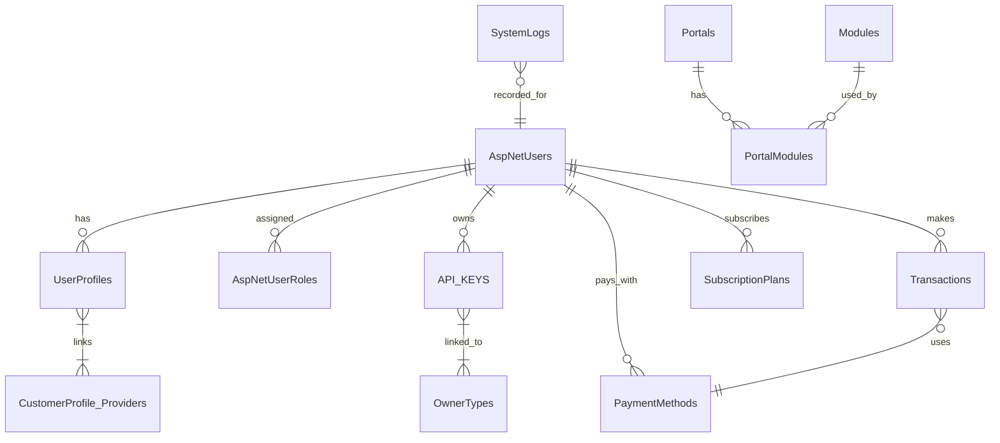
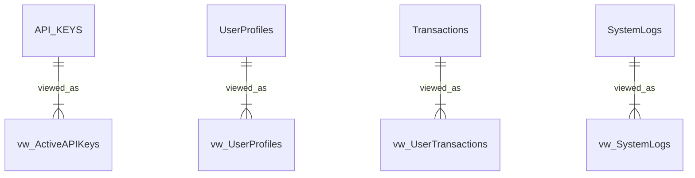

# Skylynx Server with Express.js and Nginx

## Overview

This project sets up a basic Express.js server with an Nginx reverse proxy using Docker Compose.

### Directory Structure
- `skylynx-express/`: Contains the Express.js application.
- `nginx/`: Contains the Nginx configuration.
- `docker-compose.yml`: Orchestrates the services.

### How to Run

1. Build and start the containers:
   ```bash
   docker-compose up --build
   ```

2. Access the application:
   - Open your browser and navigate to [http://localhost](http://localhost).
### SQL SererAPI
Here you can use this api to create apps,portals and websites and manage all of the users for those websites

### Notes
- Modify the `.env` file in the `skylynx-express/` folder to configure the database connection.
- Extend the `server.js` file to include additional API endpoints.

## Test High volumn

``` bash 
seq 1 1000 | xargs -n1 -P50 curl -s http://skylynxnet:5001/
```
and 

``` bash 
seq 1 1000 | xargs -n1 -P50 curl -s http://skylynxnet:8080/
```

## Test Sql 

adminUser
u:admin 
e: contact@cryptoriomarket.com
p:khaosrules4$ - Hash'$2b$12$bePn6NudkKtYKhFJpl/dRuFHFxK1Udfe2B01aTtMuMsgKerUTZIPW'

testUser
u:testuser
p:testingrules4$ ''


# **📌 SkyLynx Database & API Design Documentation**

## **📌 1. Overview**
SkyLynx is a **modular portal system** designed to handle **user authentication, API management, payments, and subscriptions** while enabling **multi-tenant portals** with dynamically assigned modules.

This document outlines the **database schema, stored procedures, views, and security considerations** for the system.

---

## **📌 2. Database Schema**
SkyLynx consists of multiple interrelated tables that support users, roles, portals, modules, API keys, payments, and transactions.

### **📊 Entity-Relationship Diagram (ERD)**


### **📌 3. Key Tables & Relationships**

| **Table Name** | **Purpose** |
|--------------|------------|
| `AspNetUsers` | Stores user authentication data. |
| `UserProfiles` | Holds additional user data (OAuth, billing, etc.). |
| `AspNetUserRoles` | Maps users to roles. |
| `Portals` | Represents different portals (e.g., SkyLynx.net, SkyLynx.live). |
| `Modules` | Defines system features (CRM, IoT, etc.). |
| `PortalModules` | Links modules to specific portals. |
| `API_KEYS` | Manages API access for users, portals, and modules. |
| `Transactions` | Logs financial transactions. |
| `PaymentMethods` | Stores user payment methods. |
| `SubscriptionPlans` | Tracks user subscriptions. |
| `SystemLogs` | Records security and system events. |

---

## **📌 4. Stored Procedures (SPs)**
Stored procedures handle **data management, security, and API calls** efficiently.

### **📌 CRUD Procedures**
| **SP Name** | **Purpose** |
|------------|------------|
| `CreateUser` | Creates a new user. |
| `UpdateUser` | Updates user details. |
| `DeleteUser` | Removes a user. |
| `GetUserById` | Retrieves user information. |
| `CreatePortal` | Creates a new portal. |
| `AssignModuleToPortal` | Links a module to a portal. |
| `CreateTransaction` | Logs a new transaction. |
| `CancelSubscription` | Cancels a user's subscription. |

### **📌 Security & Authentication Procedures**
| **SP Name** | **Purpose** |
|------------|------------|
| `GenerateApiKey` | Creates an API key for users/modules/portals. |
| `ValidateApiKey` | Checks API key validity. |
| `AssignUserRole` | Grants a user a role. |
| `RemoveUserRole` | Revokes a user role. |
| `CreateUserLogin` | Manages OAuth logins. |

---

## **📌 5. Views**
Views simplify **complex queries** by aggregating data for portals, users, transactions, and logs.

### **📌 Views & Their Purpose**
| **View Name** | **Description** |
|------------|------------|
| `vw_UserRoles` | Shows users and their roles. |
| `vw_UserProfiles` | Displays user profiles with linked OAuth providers. |
| `vw_PortalModules` | Lists modules assigned to portals. |
| `vw_ActiveAPIKeys` | Retrieves active API keys in the system. |
| `vw_UserTransactions` | Shows transaction details for each user. |
| `vw_SystemLogs` | Tracks system events and security logs. |



---

## **📌 6. Security Considerations**
SkyLynx prioritizes **security and compliance** by enforcing:
✔ **Role-Based Access Control (RBAC)** for system actions.  
✔ **Stored API Keys with hashing** to prevent unauthorized access.  
✔ **Encrypted payment methods and transactions**.  
✔ **Audit logging via `SystemLogs` to track all security events.**  

---

## **📌 7. Next Steps**
✅ **Run all tests** to verify data integrity.  
✅ **Start building the ExpressJS API in TypeScript** for backend interactions.  

🚀 Let me know if you need modifications before moving forward! 🔥
