# Skylynx Server with Express.js and Nginx

## Overview

This project sets up a basic Express.js server with an Nginx reverse proxy using Docker Compose.

### Directory Structure
- `skylynx-express/`: Contains the Express.js application.
- `nginx/`: Contains the Nginx configuration.
- `docker-compose.yml`: Orchestrates the services.

### How to Run

1. Build and start the containers:
   ```bash
   docker-compose up --build
   ```

2. Access the application:
   - Open your browser and navigate to [http://localhost](http://localhost).
### SQL SererAPI
Here you can use this api to create apps,portals and websites and manage all of the users for those websites

### Notes
- Modify the `.env` file in the `skylynx-express/` folder to configure the database connection.
- Extend the `server.js` file to include additional API endpoints.

## Test High volumn

``` bash 
seq 1 1000 | xargs -n1 -P50 curl -s http://skylynxnet:5001/
```
and 

``` bash 
seq 1 1000 | xargs -n1 -P50 curl -s http://skylynxnet:8080/
```

## Test Sql 

adminUser
u:admin 
e: contact@cryptoriomarket.com
p:khaosrules4$ - Hash'$2b$12$bePn6NudkKtYKhFJpl/dRuFHFxK1Udfe2B01aTtMuMsgKerUTZIPW'

testUser
u:testuser
p:testingrules4$ ''
Aother Test User
"email": "kurickabides@gmail.com",
password": "!khaosrules"

# **📌 SkyLynx Database & API Design Documentation**

## **📌 1. Overview**
SkyLynx is a **modular portal system** designed to handle **user authentication, API management, payments, and subscriptions** while enabling **multi-tenant portals** with dynamically assigned modules.

This document outlines the **database schema, stored procedures, views, and security considerations** for the system.

---

## **📌 2. Database Schema**
SkyLynx consists of multiple interrelated tables that support users, roles, portals, modules, API keys, payments, and transactions.

### **📊 Entity-Relationship Diagram (ERD)**
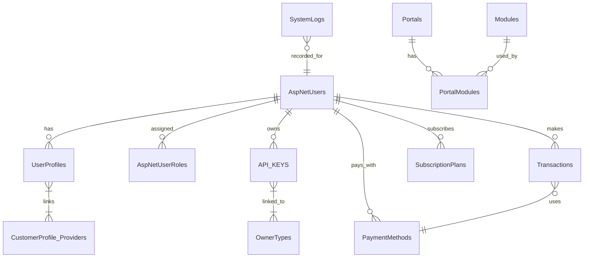
```mermaid
erDiagram
    AspNetUsers ||--o{ UserProfiles : has
    AspNetUsers ||--o{ AspNetUserRoles : assigned
    AspNetUsers ||--o{ API_KEYS : owns
    AspNetUsers ||--o{ PaymentMethods : pays_with
    AspNetUsers ||--o{ Transactions : makes
    AspNetUsers ||--o{ SubscriptionPlans : subscribes

    UserProfiles }|--|{ CustomerProfile_Providers : links

    Portals ||--o{ PortalModules : has
    Modules ||--o{ PortalModules : used_by

    API_KEYS }|--|{ OwnerTypes : linked_to

    SystemLogs }o--|| AspNetUsers : recorded_for
    Transactions }o--|| PaymentMethods : uses
```

### **📌 3. Key Tables & Relationships**

| **Table Name** | **Purpose** |
|--------------|------------|
| `AspNetUsers` | Stores user authentication data. |
| `UserProfiles` | Holds additional user data (OAuth, billing, etc.). |
| `AspNetUserRoles` | Maps users to roles. |
| `Portals` | Represents different portals (e.g., SkyLynx.net, SkyLynx.live). |
| `Modules` | Defines system features (CRM, IoT, etc.). |
| `PortalModules` | Links modules to specific portals. |
| `API_KEYS` | Manages API access for users, portals, and modules. |
| `Transactions` | Logs financial transactions. |
| `PaymentMethods` | Stores user payment methods. |
| `SubscriptionPlans` | Tracks user subscriptions. |
| `SystemLogs` | Records security and system events. |

---

## **📌 4. Stored Procedures (SPs)**
Stored procedures handle **data management, security, and API calls** efficiently.

### **📌 CRUD Procedures**
| **SP Name** | **Purpose** |
|------------|------------|
| `CreateUser` | Creates a new user. |
| `UpdateUser` | Updates user details. |
| `DeleteUser` | Removes a user. |
| `GetUserById` | Retrieves user information. |
| `CreatePortal` | Creates a new portal. |
| `AssignModuleToPortal` | Links a module to a portal. |
| `CreateTransaction` | Logs a new transaction. |
| `CancelSubscription` | Cancels a user's subscription. |

### **📌 Security & Authentication Procedures**
| **SP Name** | **Purpose** |
|------------|------------|
| `GenerateApiKey` | Creates an API key for users/modules/portals. |
| `ValidateApiKey` | Checks API key validity. |
| `AssignUserRole` | Grants a user a role. |
| `RemoveUserRole` | Revokes a user role. |
| `CreateUserLogin` | Manages OAuth logins. |

---

## **📌 5. Views**
Views simplify **complex queries** by aggregating data for portals, users, transactions, and logs.

### **📌 Views & Their Purpose**
| **View Name** | **Description** |
|------------|------------|
| `vw_UserRoles` | Shows users and their roles. |
| `vw_UserProfiles` | Displays user profiles with linked OAuth providers. |
| `vw_PortalModules` | Lists modules assigned to portals. |
| `vw_ActiveAPIKeys` | Retrieves active API keys in the system. |
| `vw_UserTransactions` | Shows transaction details for each user. |
| `vw_SystemLogs` | Tracks system events and security logs. |

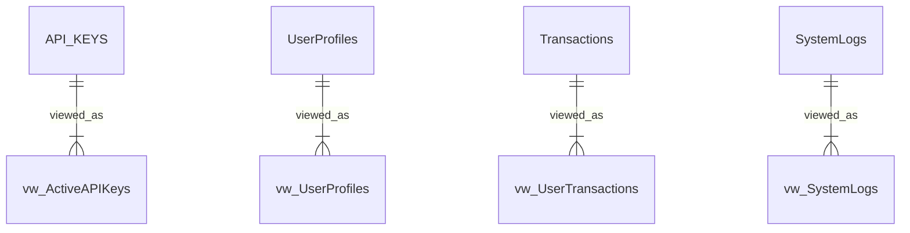
```mermaid
erDiagram
    API_KEYS ||--|{ vw_ActiveAPIKeys : viewed_as
    UserProfiles ||--|{ vw_UserProfiles : viewed_as
    Transactions ||--|{ vw_UserTransactions : viewed_as
    SystemLogs ||--|{ vw_SystemLogs : viewed_as
```

---

## **📌 6. Security Considerations**
SkyLynx prioritizes **security and compliance** by enforcing:
✔ **Role-Based Access Control (RBAC)** for system actions.  
✔ **Stored API Keys with hashing** to prevent unauthorized access.  
✔ **Encrypted payment methods and transactions**.  
✔ **Audit logging via `SystemLogs` to track all security events.**  

---

## 🧠 Design Principles

- 🔐 **Security First**: API keys are stored as SHA-256 hashes. All requests are authenticated via `skyx-api-key` and `skyx-portal-id` headers.
- 🏢 **Multi-Tenant Architecture**: Portals, users, modules, and API keys are decoupled for reusability and scaling.
- ♻️ **Reusability & Modularity**: Validation logic lives in SQL Server functions (`fn_IsValidAPIKey`) for performance and reuse.

---

## 🗃️ Database Design (ER Diagram)

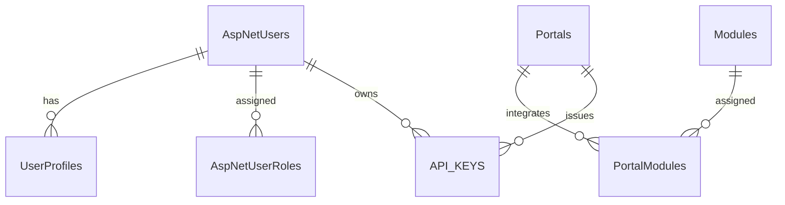
```mermaid
erDiagram
    AspNetUsers ||--o{ API_KEYS : owns
    AspNetUsers ||--o{ AspNetUserRoles : assigned
    AspNetUsers ||--o{ UserProfiles : has
    Portals ||--o{ API_KEYS : issues
    Modules ||--o{ PortalModules : assigned
    Portals ||--o{ PortalModules : integrates
```
## 📘 Dyform User Profile Design — Server Workflow and Data Exchange

---

### 🌟 Objective

Design a full end-to-end data architecture and workflow for retrieving and updating user profile information using the **Dyform** metadata-driven system.

We aim to dynamically generate user forms from metadata while resolving values from different source tables. This design document breaks down:

- Database table roles
- View vs. Field expressions
- Server responsibilities
- Client-side expectations (only inputs/outputs)
- API interaction workflows

---

### 📂 Key Tables Involved

## 🔁 Auth & API Flow

### 🔑 API Authentication Flow

1. Client sends headers:
   - `skyx-api-key`: **Plaintext key**
   - `skyx-portal-id`: **Portal name**

2. Server:
   - Hashes the API key.
   - Resolves portal name to PortalID via view.
   - Validates both values using SQL Server `fn_IsValidAPIKey`.

---

## 🧪 Sample Test Script (Linux/macOS)

### High-Volume Testing

```bash
seq 1 1000 | xargs -n1 -P50 curl -s http://localhost:3200/api/test-post -H "skyx-api-key: testkey123" -H "skyx-portal-id: SkyLynxNet" -d '{}'
```

### SQL Manual Validation (Example Only)

```sql
EXEC ValidateOwnerApiKey
    @PlainApiKey = '2EEBE1A1-23CD-4C16-96E7-567C02EF79EA',
    @PortalName = 'SkyLynxNet';
```
## 🔄 API Runtime Flow Diagram

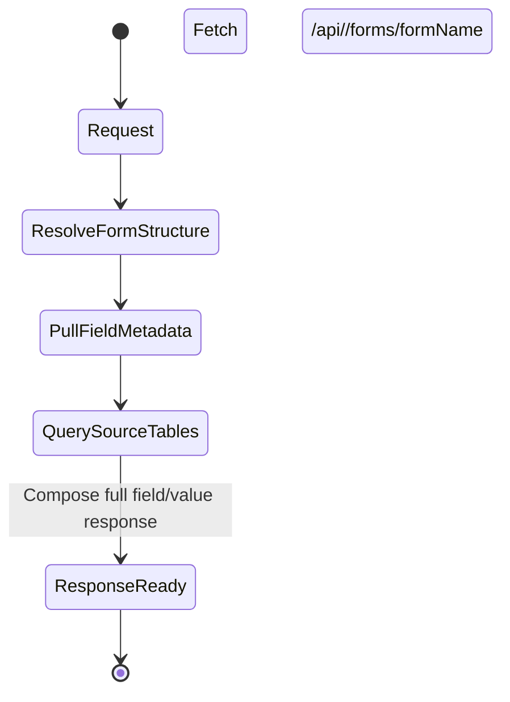
```mermaid
stateDiagram-v2
    state Request
    [*] --> Request
    Request --> ResolveFormStructure Fetch /api//forms/formName
    ResolveFormStructure --> PullFieldMetadata
    PullFieldMetadata --> QuerySourceTables
    QuerySourceTables --> ResponseReady: Compose full field/value response
    ResponseReady --> [*]
```


---

### Example Data Table Sources

| Table                  | Role                                 |
| ---------------------- | ------------------------------------ |
| `AspNetUsers`          | Stores username, email, phone, etc.  |
| `UserProfiles`         | SkylynxNet-specific profile fields   |
| `UserProviderProfiles` | Dynamic field-value mapping          |
| `Address`              | Stores mailing and billing addresses |

---

# 📘 DyForm Design — Metadata-Driven Forms

## ❓ Why DyForm

SkyLynx uses the **DyForm** system to enable dynamic, metadata-driven form generation and management. Rather than hardcoding UI elements or database mappings, DyForm treats each form as a flexible composition of:

- **Sections** and **Fields** stored as metadata  
- **Expressions** that resolve where and how to get/set data  
- **Rules** that drive validation, visibility, and behavior

### ✅ Benefits

- **Dynamic UI Generation**  
  Forms are rendered based on metadata — no frontend code change needed to add or modify fields.

- **Multi-source Data Binding**  
  Fields can resolve from `AspNetUsers`, `UserProfiles`, `ProviderProfileFields`, or SPs — all declaratively.

- **Reusability & Portability**  
  With templated sections and versioning (via `Protos`), the same DyForm layout can be reused across portals or modules.

- **Separation of Concerns**  
  Business rules, data access, and UI structure are decoupled, aligning with **Builder**, **Strategy**, and **Interpreter** patterns.

- **SP-First Resolver Logic**  
  All field writes are directed through stored procedures, maintaining a secure and auditable architecture.

---

## 🧩 DyForm Tables (Metadata Only)

| **Table**                         | **Description**                                                                 |
|----------------------------------|---------------------------------------------------------------------------------|
| `DyForm`                         | Represents a logical form (e.g., `UserProfile`)                                 |
| `DyFormSection`                  | Defines individual section containers (e.g., `Contact Info`)                    |
| `DyFormSections`                 | Links sections to forms with sort order and optional nesting                    |
| `DyFormField`                    | Stores raw field metadata including type, label, domain                         |
| `DyFormFieldType`               | Master list of input types (e.g., `TextInput`, `DatePicker`, `Dropdown`)        |
| `DyFormDomains`                  | Domain source metadata (e.g., `CountryList`, `StateCodes`)                      |
| `DyFormDomainValues`            | Key-value entries for each domain (value + label + order)                       |
| `DyFormDomainType`              | Classifies domains as value-list, range, etc.                                   |
| `DyFormExpression`              | Field-level expressions for computing or resolving dynamic values               |
| `DyFormResolverType`            | Lookup for how data is resolved (e.g., `Static`, `API`, `Lookup`, `Expression`) |
| `DyFormResolverContext`         | Scoped context keys (e.g., `FieldDefault`, `VisibilityRule`)                    |
| `DyFormResolvers`               | Form-level resolver logic mapped by context and type                            |
| `DyFormSectionResolvers`        | Section-specific resolver logic by context and type                             |
| `DyFormFieldRule`               | Rules applied to fields (validation, enable/disable, computed)                  |
| `DyFormRuleType`                | Defines rule behavior (e.g., `Required`, `Regex`, `VisibleIf`)                  |
| `DyFormRuleSyntax`              | Parsing approach used in rule expressions (e.g., `Simple`, `Lambda`)            |
| `DyFormRuleDefinition`          | Declarative rule logic based on reusable expressions                            |
| `DyFormRuleTarget`              | Links rules to form field(s), section(s), or view(s)                             |
| `DyFormViewModelDefinition`     | Named ViewModel outputs for templated rendering                                 |
| `DyFormFieldSectionDefinition`  | Maps fields into sections within a ViewModel                                    |
| `DyFormDataSourceDefinition`    | Resolves field data source paths and binding instructions                       |


## 🧠 Schema Model


```mermaid
erDiagram

  DyForm ||--o{ DyFormSections : contains
  DyFormSections ||--|| DyForm : Form
  DyFormSections ||--|| DyFormSection : section
  DyFormSections ||--|| DyFormSections : parentSection

  DyFormField ||--|| DyFormFieldType : uses
  DyFormField ||--|| DyFormDomains : domainSource

  DyFormDomains ||--|| DyFormDomainType : typed_as
  DyFormDomains ||--o{ DyFormDomainValues : has

  DyFormFieldRule ||--|| DyFormField : validates
  DyFormFieldRule ||--|| DyFormResolverType : ruleType
  DyFormFieldRule ||--|| DyFormRuleType : logicType

  DyFormExpression ||--|| DyFormResolverType : expressionType

  DyFormFieldSectionDefinition ||--|| DyFormField : usesField
  DyFormFieldSectionDefinition ||--|| DyFormSection : inSection
  DyFormFieldSectionDefinition ||--|| DyFormViewModelDefinition : partOfViewModel
  DyFormFieldSectionDefinition ||--|| DyFormDataSourceDefinition : getsDataFrom

  DyFormRuleDefinition ||--|| DyFormExpression : basedOn
  DyFormRuleDefinition ||--|| DyFormResolverType : type

  DyFormRuleTarget ||--|| DyFormRuleDefinition : rule
  DyFormRuleTarget ||--|| DyFormField : optionalField
  DyFormRuleTarget ||--|| DyFormSection : optionalSection
  DyFormRuleTarget ||--|| DyFormViewModelDefinition : forView

  DyFormResolvers ||--|| DyForm : resolvesFor
  DyFormResolvers ||--|| DyFormResolverContext : inContext
  DyFormResolvers ||--|| DyFormResolverType : type

  DyFormSectionResolvers ||--|| DyForm : inForm
  DyFormSectionResolvers ||--|| DyFormSection : forSection
  DyFormSectionResolvers ||--|| DyFormResolverContext : context
  DyFormSectionResolvers ||--|| DyFormResolverType : resolver

  DyForm {
    UUID FormID PK
    NVARCHAR(100) FormName
    NVARCHAR(255) Description
    DATETIME CreatedAt
  }

  DyFormSection {
    UUID SectionID PK
    NVARCHAR(100) SectionName
    INT SortOrder
    NVARCHAR(255) Label
  }

  DyFormSections {
    UUID FormSectionID PK
    UUID FormID FK
    UUID SectionID FK
    UUID ParentFormSectionID FK
    INT SortOrder
  }

  DyFormField {
    UUID DyFormFieldID PK
    UUID FieldTypeID FK
    NVARCHAR(255) Tooltip
    NVARCHAR(255) Label
    UUID DomainID FK
  }

  DyFormFieldType {
    UUID FieldTypeID PK
    NVARCHAR(100) FieldTypeName
    NVARCHAR(100) ComponentName
  }

  DyFormDomains {
    UUID DomainID PK
    NVARCHAR(100) Name
    UUID DomainTypeID FK
    NVARCHAR(255) Description
  }

  DyFormDomainType {
    UUID DomainTypeID PK
    NVARCHAR(100) DomainTypeName
    NVARCHAR(255) Description
  }

  DyFormDomainValues {
    UUID DomainValueID PK
    UUID DomainID FK
    NVARCHAR(200) Value
    NVARCHAR(200) Label
    INT SortOrder
  }

  DyFormFieldRule {
    UUID RuleID PK
    UUID FieldID FK
    UUID RuleTypeID FK
    UUID ResolverTypeID FK
    NVARCHAR(MAX) RuleExpression
    BIT IsEnabled
    INT Priority
    NVARCHAR(255) ErrorMessage
  }

  DyFormRuleType {
    UUID RuleTypeID PK
    NVARCHAR(100) Name
    NVARCHAR(255) Description
  }

  DyFormResolverType {
    UUID ResolverTypeID PK
    NVARCHAR(100) Name
    NVARCHAR(255) Description
  }

  DyFormRuleSyntax {
    UUID RuleSyntaxID PK
    NVARCHAR(100) SyntaxName
    NVARCHAR(255) Description
    DATETIME CreatedAt
    DATETIME UpdatedAt
  }

  DyFormExpression {
    UUID DyFormExpressionID PK
    NVARCHAR(MAX) Expression
    UUID ResolverTypeID FK
    NVARCHAR(255) Description
  }

  DyFormViewModelDefinition {
    UUID ViewModelDefinitionID PK
    NVARCHAR(100) ViewModelName
    NVARCHAR(255) DestKey
  }

  DyFormDataSourceDefinition {
    UUID DyFormDSDefinitionID PK
    NVARCHAR(255) SourceKey
    BIT IsDirectProperty
    NVARCHAR(MAX) SourcePath
  }

  DyFormFieldSectionDefinition {
    UUID SectionDefinitionID PK
    UUID SectionID FK
    UUID DyFormFieldID FK
    UUID ViewModelDefinitionID FK
    INT SortOrder
    UUID DyFormDSDefinitionID FK
  }

  DyFormRuleDefinition {
    UUID RuleDefinitionID PK
    NVARCHAR(100) RuleKey
    UUID ResolverTypeID FK
    UUID DyFormExpressionID FK
    NVARCHAR(255) Description
  }

  DyFormRuleTarget {
    UUID RuleTargetID PK
    UUID RuleDefinitionID FK
    UUID ViewModelDefinitionID FK
    UUID DyFormFieldID FK
    UUID SectionID FK
    INT SortOrder
    NVARCHAR(1000) Notes
  }

  DyFormResolverContext {
    NVARCHAR(50) Context PK
    NVARCHAR(255) Description
  }

  DyFormResolvers {
    UUID DyFormID FK
    NVARCHAR(50) ResolverContext FK
    UUID ResolverTypeID FK
    NVARCHAR(255) ResolverTarget
    NVARCHAR(1000) Description
    DATETIME CreatedAt
    DATETIME UpdatedAt
  }

  DyFormSectionResolvers {
    UUID DyFormID FK
    UUID SectionID FK
    NVARCHAR(50) ResolverContext FK
    UUID ResolverTypeID FK
    NVARCHAR(255) ResolverTarget
    BIT IsActive
    NVARCHAR(1000) Notes
    DATETIME CreatedAt
    DATETIME UpdatedAt
  }


```


## 📐 Protos Template System — Design Overview

The **Protos** schema is the foundation for a flexible, version-controlled templating system that enables dynamic composition of Portals, Modules, Forms, and Pages within the SkyLynx architecture. It follows the **Prototype Pattern**, allowing templates to be cloned, extended, and versioned with lightweight references.

---

### 💡 Purpose

To define reusable structural blueprints (templates) that can be applied dynamically across:

- Form rendering (`DyForm` integration)
- Portal composition (dynamic layout generation)
- Module wiring and assignment

---

### 🧱 Core Tables (`Protos` Schema)

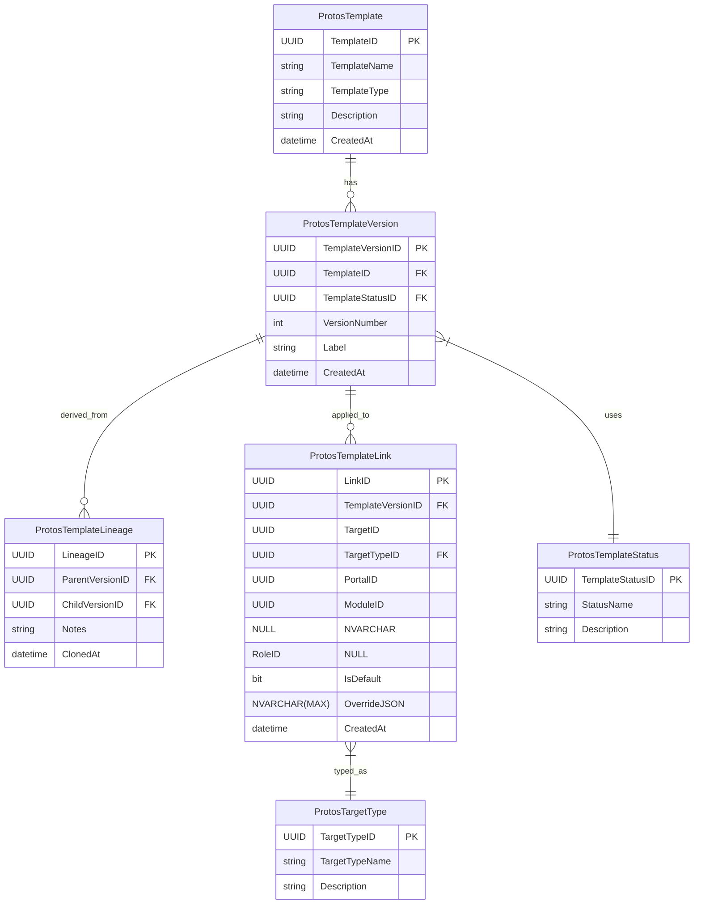
```mermaid
erDiagram

  ProtosTemplate ||--o{ ProtosTemplateVersion : has
  ProtosTemplateVersion ||--o{ ProtosTemplateLineage : derived_from
  ProtosTemplateVersion ||--o{ ProtosTemplateLink : applied_to
  ProtosTemplateVersion }|--|| ProtosTemplateStatus : uses
  ProtosTemplateLink }|--|| ProtosTargetType : typed_as

  ProtosTemplate {
    UUID TemplateID PK
    string TemplateName
    string TemplateType
    string Description
    datetime CreatedAt
  }

  ProtosTemplateVersion {
    UUID TemplateVersionID PK
    UUID TemplateID FK
    UUID TemplateStatusID FK
    int VersionNumber
    string Label
    datetime CreatedAt
  }

  ProtosTemplateStatus {
    UUID TemplateStatusID PK
    string StatusName
    string Description
  }

  ProtosTemplateLineage {
    UUID LineageID PK
    UUID ParentVersionID FK
    UUID ChildVersionID FK
    string Notes
    datetime ClonedAt
  }

  ProtosTemplateLink {
    UUID LinkID PK
    UUID TemplateVersionID FK
    UUID TargetID
    UUID TargetTypeID FK
    UUID PortalID 
    UUID ModuleID NULL
    NVARCHAR RoleID NULL
    bit IsDefault
    NVARCHAR(MAX) OverrideJSON
    datetime CreatedAt
  }

  ProtosTargetType {
    UUID TargetTypeID PK
    string TargetTypeName
    string Description
  }


```

---

### 🔄 Relationship to `DyForm`

| `DyForm` Entity | Usage in `ProtosTemplateLink`                         |
| --------------- | ----------------------------------------------------- |
| `DyForm.FormID` | Linked via `TargetID` where `TargetTypeName = 'Form'` |
| `DyFormSection` | Not directly templated (inherits from form)           |
| `DyFormField`   | Defined by template lineage                           |

> Protos doesn’t replace `DyForm`, it wraps it with a reusable **template shell** for cloning and customization.

---

### 🧠 Design Advantages

- 📦 **Reuse-first**: Templates can be authored once, and reused across Portals, Modules, etc.
- 🧬 **Versioning**: Templates are immutable once published. Versions can be cloned and evolved.
- 🪞 **Prototype Pattern**: Templates derive structure from a parent while customizing behavior per usage.
- 🛠 **Dynamic Linking**: A `TemplateLink` determines when and where a template version is active.
- 🔀 **Form Flexibility**: `DyForm`-based forms can be plugged into Portals or Modules via Protos.

---

### ⚙️ Supporting Design Patterns (GoF + Data-Centric)

| Pattern                     | Role in Design                                                                    |
| --------------------------- | --------------------------------------------------------------------------------- |
| **Prototype**               | Core to template cloning/versioning (`ProtosTemplateVersion`, `Lineage`)          |
| **Composite**               | `DyFormSection` nesting inside `DyForm`, allowing recursive UI construction       |
| **Strategy**                | Resolvers/Rules as runtime-selected logic (`ResolverType`, `RuleType`)            |
| **Flyweight**               | Shared domain values/components (e.g., states, languages) via `DyFormDomains`     |
| **Bridge**                  | Linking templates to runtime targets (Portals, Modules, Forms) via `TemplateLink` |
| **Builder**                 | UI rendering builds sections from field metadata dynamically                      |
| **Chain of Responsibility** | Resolution flow: Expression → SP → View → Fallback Default                        |
| **State**                   | Draft → Published → Archived lifecycles of `ProtosTemplateVersion`                |
| **Observer**                | Future pattern to alert modules on template change via `TemplateChangeLog`        |
| **Interpreter**             | Parse and enforce rule expressions and field logic                                |
| **Decorator**               | Optional overrides applied at `TemplateLink` to customize reused templates        |

---

## ✅ Design Breakthrough: Reusable Sections & Multi-Parent Composition

> This section documents a critical architecture issue identified during the evolution of the SkyLynx Dyform system and the introduction of a templating system (`Protos`) that resolved it.

---

### ❗ Original Limitation in `DyFormSection`

In the initial `DyForm` schema:

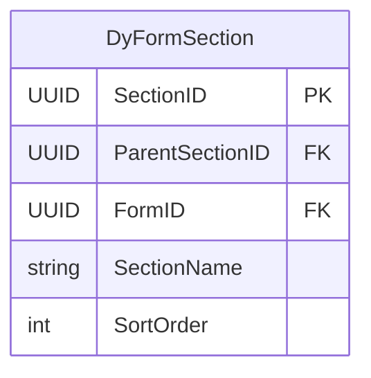
```mermaid
erDiagram

  DyFormSection {
    UUID SectionID PK
    UUID ParentSectionID FK
    UUID FormID FK
    string SectionName
    int SortOrder
  }

```

- `DyFormSection` was structured as a **strict hierarchy** using `ParentSectionID`.
- This made sections **form-local and tightly coupled**, limiting reuse.
- The structure **enforced single-parent nesting**, so a section could not:
  - Appear in more than one parent section.
  - Be reused across multiple forms.

This became a blocker when common substructures like **Mailing Address** or **Billing Info** were needed in multiple forms or multiple places in the same form.

---

### 💡 Problem Statement

> “Mailing Address” should be able to exist **once**, but appear in **multiple parent contexts** — such as:
> - Under “User Info”
> - Under “Billing Info”
> - In multiple forms entirely

---

### ✅ Architectural Solution: `ProtosTemplate` System

The new `Protos` schema introduces a full **template-based composition** engine that:

- Detaches form logic from its static structure.
- Enables reusability and modularity through **template versions** and **template links**.

Key Components:

| Table                  | Role |
|------------------------|------|
| `ProtosTemplate`       | Defines the reusable structure (e.g., a form layout or component group). |
| `ProtosTemplateVersion` | Enables cloning and evolving templates safely over time. |
| `ProtosTemplateLink`   | Bridges templates to **targets** like `DyForm`, `Portal`, or `Module`. |

---

``` mermaid
erDiagram

    DyFormViewModelDefinition ||--o{ DyFormViewModelLineage : Children
    DyFormViewModelDefinition ||--o{ DyFormFieldSectionDefinition : MapsFields
    DyFormViewModelDefinition ||--o{ ProtosViewModelDefinition : UsedInProtos
    ProtosTemplateVersion ||--o{ ProtosViewModelDefinition : Versioned
    ProtosTargetType ||--o{ ProtosViewModelDefinition : Targets

    DyFormViewModelDefinition {
        UUID ViewModelDefinitionID
        string ViewModelName
    }

    ProtosViewModelDefinition {
        UUID ProtosViewModelDefinitionID
        UUID TemplateVersionID
        UUID TargetTypeID
        UUID TargetObjectID --> DyFormViewModelDefinitionID
    }
```
### 🧬 What This Enables

| Capability | Description |
|------------|-------------|
| ✅ Multi-parent Sections | A section like `Mailing Address` can be part of **multiple parents** via template structure. |
| ✅ Form Decomposition | Shared logic can live in base templates and be extended. |
| ✅ Reuse Across Forms | A single versioned template can be reused in different user flows. |
| ✅ Overrides per Context | Decorator pattern allows optional overrides at the link level. |

---

### 🔧 Patterns Applied

| Pattern | Role in Solution |
|---------|------------------|
| **Prototype** | Enables versioned templates that can be cloned and customized. |
| **Flyweight** | Promotes reuse of shared layout structures like address sections. |
| **Bridge** | Decouples structural templates from runtime targets. |
| **Composite** | Still used within a template (sections within sections), but no longer required for logic-level reuse. |
| **Decorator** | (Optional) For contextual overrides per use. |

---

### 📍 Where to Insert This

**Insert after this section in `Design.md`:**

> ## 📐 Protos Template System — Design Overview

**Insert before this section:**

> ## 🔄 API Runtime Flow Diagram

### 🧬 Data Modeling Patterns (DDD-inspired)

| Concept               | Application                                                           |
| --------------------- | --------------------------------------------------------------------- |
| **ViewModel**         | What client receives from `GET /api/Dyform/:formName` — clean UI shape |
| **Entity Model**      | Stored metadata from `DyForm` and `ProtosTemplate`                    |
| **Form Data Model**   | Values submitted from frontend → API (raw JSON + field/value pairs)   |
| **Validation Model**  | Encapsulated in `DyformFieldRule`, enforced at render and post-submit  |
| **Persistence Model** | SP-first design ensures reliable storage per resolver + table map     |

> These models are *decoupled* by intent. UI receives a ViewModel, but backend processes against a normalized Persistence Model.

---
API / Routes

---


Let me know if you'd like the SQL DDLs or SP scaffolds generated for `ProtosTemplate`, `ProtosTemplateVersion`, etc.


### 📥 GET Request — Load User Profile Form

### Route

`GET /api/Dyform/UserProfile/:userId`

### Server Flow

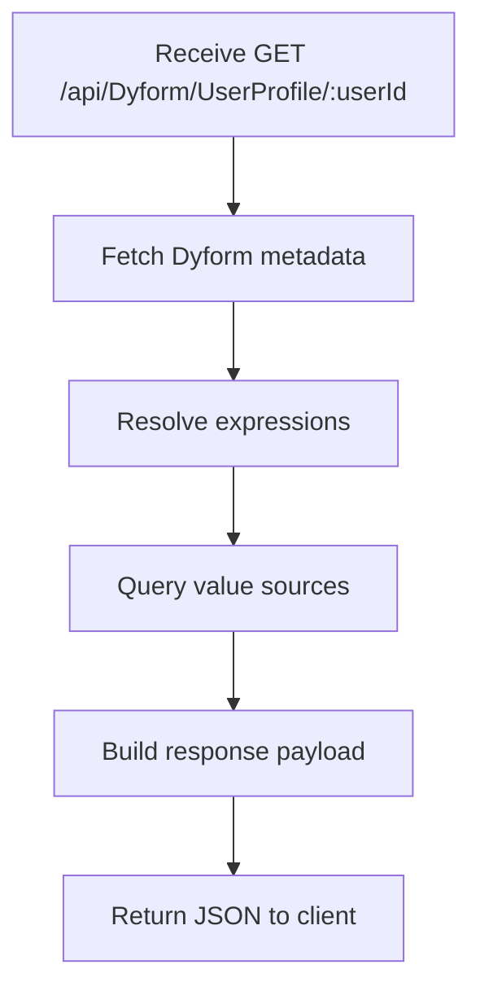
```mermaid
graph TD
  A[Receive GET /api/Dyform/UserProfile/:userId]
  B[Fetch Dyform metadata]
  C[Resolve expressions]
  D[Query value sources]
  E[Build response payload]
  F[Return JSON to client]

  A --> B --> C --> D --> E --> F
```

### What Server Does

1. Reads Dyform, DyformSections, and DyformFields for form `UserProfile`
2. Joins with `FieldType`, `DyformExpression`, and optionally `DyformDomainValues`
3. Parses each `DyformExpression.fieldExpression`
4. Resolves value from appropriate table using current `:userId`
5. Builds structured payload of field definitions **with resolved values**
6. Includes domain values if defined for dropdowns or validation lists
7. Evaluates applicable `DyformFieldRule` entries

### Response Example

```json
{
  "formName": "UserProfile",
  "sections": [
    {
      "name": "Contact Info",
      "fields": [
        {
          "fieldId": "abc-123",
          "label": "Email",
          "tooltip": "Enter email",
          "value": "user@example.com",
          "type": "EmailInput",
          "rules": [
            { "type": "isRequired", "value": true },
            {
              "type": "validation",
              "value": {
                "regex": "^\\S+@\\S+\\.\\S+$",
                "message": "Invalid email"
              }
            }
          ],
          "options": [
            { "label": "Work", "value": "work" },
            { "label": "Personal", "value": "personal" }
          ]
        }
      ]
    }
  ]
}
```

---

## 📝 PUT Request — Update User Profile

### Route

`PUT /api/Dyform/UserProfile/:userId`

### Client Sends

```json
{
  "formId": "form-guid",
  "sectionId": "section-guid",
  "fields": [
    {
      "fieldId": "abc-123",
      "value": "new@example.com"
    }
  ]
}
```

### Server Flow

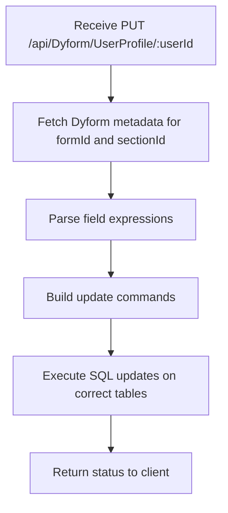
```mermaid
graph TD
  A[Receive PUT /api/Dyform/UserProfile/:userId]
  B[Fetch Dyform metadata for formId and sectionId]
  C[Parse field expressions]
  D[Build update commands]
  E[Execute SQL updates on correct tables]
  F[Return status to client]

  A --> B --> C --> D --> E --> F
```

### What Server Does

1. Loads metadata for each `fieldId`
2. Looks up associated `DyformExpression`
3. Decodes expression:
   ```json
   {
     "table": "AspNetUsers",
     "column": "Email",
     "keyField": "UserID"
   }
   ```
4. Constructs UPDATE statement:
   ```sql
   UPDATE AspNetUsers SET Email = 'new@example.com' WHERE Id = :userId;
   ```
5. Executes updates
6. Returns 200 OK or error

---

## 🧠 Advanced Notes

### Supported `resolverType`

| ResolverType | Use Case                       | Behavior                     |
| ------------ | ------------------------------ | ---------------------------- |
| `table`      | Direct column updates          | Standard `UPDATE`/`INSERT`   |
| `pivot`      | Field-value key mapping        | `UserProviderProfiles`-style |
| `sp`         | Stored procedure update/create | `EXEC sp_name`               |
| `dbFn`       | SQL function computed values   | Read-only                    |
| `sql`        | Custom SQL snippet (read-only) | `SELECT ... FROM ...`        |
| `json`       | Static client config           | JSON-only values             |
| `template`   | Text rendering helper          | Label substitution           |
| `function`   | Programmatic logic (future)    | App-controlled               |

### Domain Tables

#### `DyformDomains`

| Column     | Description                  |
| ---------- | ---------------------------- |
| DomainID   | Primary Key                  |
| Name       | Name of the domain           |
| DomainType | `value`, `range`, `regex`... |

#### `DyformDomainValues`

| Column    | Description   |
| --------- | ------------- |
| DomainID  | FK to domain  |
| Value     | Option value  |
| Label     | Option label  |
| SortOrder | Display order |

### Field Rules via `DyformFieldRule`

| RuleID | FieldID | RuleType     | ResolverType | RuleExpression                                   | Enabled | Priority | ErrorMessage        |
| ------ | ------- | ------------ | ------------ | ------------------------------------------------ | ------- | -------- | ------------------- |
| 1      | abc123  | `isRequired` | `json`       | `true`                                           | true    | 1        |                     |
| 2      | abc123  | `validation` | `json`       | `{ "regex": "^[0-9]{10}$" }`                     | true    | 2        | "Must be 10 digits" |
| 3      | abc123  | `isHidden`   | `json`       | `{ "if": {"field": "Role", "equals": "Admin" }}` | true    | 3        |                     |
| 4      | abc123  | `computed`   | `json`       | `{ "expr": "Lower(First + '.' + Last)" }`        | true    | 4        |                     |

---

## 📦 What Server Sends to Client

| Property     | Description                             |
| ------------ | --------------------------------------- |
| `formName`   | Name of form (e.g., `UserProfile`)      |
| `sections[]` | List of form sections                   |
| `fields[]`   | Per-section fields with resolved values |
| `options[]`  | Predefined values for select fields     |
| `rules[]`    | UI logic and validation rules           |
| `domains[]`  | List of domain sets and their options   |

---
### Server Flow to UI
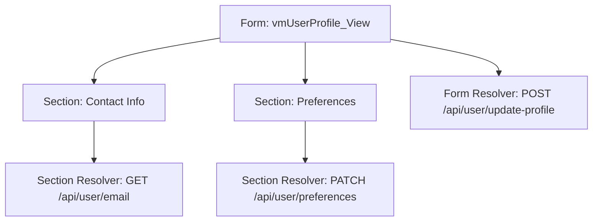
``` mermaid
flowchart TD
  F[Form: vmUserProfile_View]
  F --> C1[Section: Contact Info]
  F --> C2[Section: Preferences]
  F --> R[Form Resolver: POST /api/user/update-profile]

  C1 --> R1[Section Resolver: GET /api/user/email]
  C2 --> R2[Section Resolver: PATCH /api/user/preferences]

```

## 🔁 What Client Sends Back

| Field       | Description                             |
| ----------- | --------------------------------------- |
| `formId`    | ID of form being edited                 |
| `sectionId` | ID of section being edited              |
| `fields[]`  | Array of `{ fieldId, value }` to update |

---
### User Profile SetUp 
Below is a table that outline the configuration setup of Portal gives a good example of how our DyForm system will dynamically build forms for using this config found below 
## ✅ UserProfile Dyform — Seeding Example 

| **Section → SubSection**            | **Field Name**           | **Label**                | **Field Type**         | **Resolver Type** | **Stored Procedure / Source**                  | **Domain**     | **Notes / Rules**                        |
|-------------------------------------|---------------------------|---------------------------|------------------------|-------------------|-----------------------------------------------|----------------|------------------------------------------|
| **User Info → Preferences**         | Photo                    | Profile Photo             | Link                   | sp                | `GetUserProfileFieldValue` / `SetUserProfileFieldValue` | *(none)*       | Optional; from `UserProviderProfiles`    |
|                                     | UserName                 | Username                  | TextInput              | sp                | `GetUserById`, `UpdateUser`                   | *(none)*       | Editable login name                      |
|                                     | PreferredLanguage        | Preferred Language        | MUI_Select             | sp                | `GetUserProfileFieldValue` / `SetUserProfileFieldValue` | LanguageList   | Uses domain                               |
|                                     | TwoFactorEnabled         | Two-Factor Auth Enabled   | MUI_Switch             | sp                | `GetUserSecurityStatus`, `UpdateSecuritySettings` | YesNo          | Boolean toggle                            |
| **User Info → Contact Information** | Email                    | Email                     | EmailInput             | sp                | `GetUserById`, `UpdateUser`                   | *(none)*       | Required, validated                       |
|                                     | PhoneNumber              | Primary Phone             | PhoneInput             | sp                | `GetUserById`, `UpdateUser`                   | *(none)*       | Optional                                  |
|                                     | Phone                    | Mobile Phone              | PhoneInput             | sp                | `GetUserProfileFieldValue` / `SetUserProfileFieldValue` | *(none)*       | Optional                                  |
| **User Info → Mailing Address**     | Address1                 | Address Line 1            | TextInput              | sp                | `GetUserMailingAddress`, `UpdateUserAddress` | *(none)*       | Optional                                  |
|                                     | Address2                 | Address Line 2            | TextInput              | sp                | same as above                                 | *(none)*       | Optional                                  |
|                                     | City                     | City                      | TextInput              | sp                | same as above                                 | *(none)*       | Optional                                  |
|                                     | Zip                      | Zip Code                  | TextInput              | sp                | same as above                                 | *(none)*       | Optional                                  |
|                                     | StateProvinceID          | State                     | MUI_Select             | sp                | `GetStates`, `UpdateUserAddress`             | States         | Optional; domain                          |
| **User Info → Personal Details**    | FirstName                | First Name                | TextInput              | sp                | `GetUserProfileFieldValue` / `SetUserProfileFieldValue` | *(none)*       | Required                                  |
|                                     | LastName                 | Last Name                 | TextInput              | sp                | same as above                                 | *(none)*       | Required                                  |
|                                     | DateOfBirth              | Date of Birth             | MUI_DatePicker         | sp                | same as above                                 | *(none)*       | Optional                                  |
| **Account Info → ⬆ (main)**         | EmailConfirmed           | Email Confirmed           | RadioYesNo             | sp                | `GetUserSecurityStatus`, `UpdateSecuritySettings` | YesNo          | Admin-only                                |
|                                     | PhoneNumberConfirmed     | Phone Confirmed           | RadioYesNo             | sp                | same as above                                 | YesNo          | Admin-only                                |
|                                     | AccessFailedCount        | Login Failures            | NumberButton           | sp                | `GetUserSecurityStatus`                       | *(none)*       | Read-only/admin-edit                      |
|                                     | CreatedAt                | Created Date              | MUI_StandardTextField  | sp                | `GetUserProfileMeta`                          | *(none)*       | Read-only                                  |
|                                     | UpdatedAt                | Updated Date              | MUI_StandardTextField  | sp                | same as above                                 | *(none)*       | Read-only                                  |
| **Account Info → Billing Information** | BillingAddress1         | Billing Address Line 1    | TextInput              | sp                | `GetUserBillingAddress`, `UpdateBillingAddress` | *(none)*       | Optional                                  |
|                                     | BillingAddress2          | Billing Address Line 2    | TextInput              | sp                | same as above                                 | *(none)*       | Optional                                  |
|                                     | BillingCity              | Billing City              | TextInput              | sp                | same as above                                 | *(none)*       | Optional                                  |
|                                     | BillingZip               | Billing Zip Code          | TextInput              | sp                | same as above                                 | *(none)*       | Optional                                  |
|                                     | BillingStateProvinceID   | Billing State             | MUI_Select             | sp                | `GetStates`, `UpdateBillingAddress`          | States         | Optional                                  |
| **Account Info → Portal Accounts**  | PortalName               | Portal Name               | TextInput              | sp                | `GetPortalById`                               | *(none)*       | Read-only                                  |
|                                     | PortalDescription        | Portal Description        | TextareaInput          | sp                | same as above                                 | *(none)*       | Optional                                   |
|                                     | PortalCreatedDate        | Portal Created Date       | MUI_StandardTextField  | sp                | same as above                                 | *(none)*       | Read-only                                  |
| **Account Info → Portal Providers** | ProviderName             | Provider Name             | TextInput              | sp                | `GetPortalProviders`                          | *(none)*       | From joined view                          |
|                                     | IsSystemDefault          | System Provider?          | RadioYesNo             | sp                | same as above                                 | YesNo          | Boolean                                   |
|                                     | IsPortalDefault          | Portal Default Provider?  | RadioYesNo             | sp                | same as above                                 | YesNo          | Boolean                                   |

## ✅ Summary

- Server drives UI from Dyform + metadata
- Field values resolved via expressions (per field)
- Updates target various tables depending on `resolverType`
- Domain values and validations supported
- Supports both fixed tables and dynamic key-value fields
- **Dyform metadata is metadata only** — not value storage
- **Rules define all behavior**: required, hidden, computed, validated
- **Resolvers** support flexible targeting via SQL, expressions, or metadata


---
Protos Sechme Seeding example to make Dyform reusable

## 🧰 Developer Notes

- Headers used in production:
  - `skyx-api-key`: API Key sent in plaintext.
  - `skyx-portal-id`: Hashed or plain portal name depending on API contract.

- `ValidateOwnerApiKey` and `fn_IsValidAPIKey` are core components for secured middleware checks.

- Logging and traceability included via `console.log()` in middleware to aid debugging.

---

## ✅ Next Steps

- Integrate frontend and test all endpoints using Postman or curl.
- Extend SQL Server SPs for subscription/billing workflows.
- Generate user-facing documentation for API usage (separate from this system-level doc).

Let me know if you’d like:
- Individual stored procedure/function descriptions.
- Test endpoint diagrams.
- Postman Collection JSON export.

## SigUp Workfolw

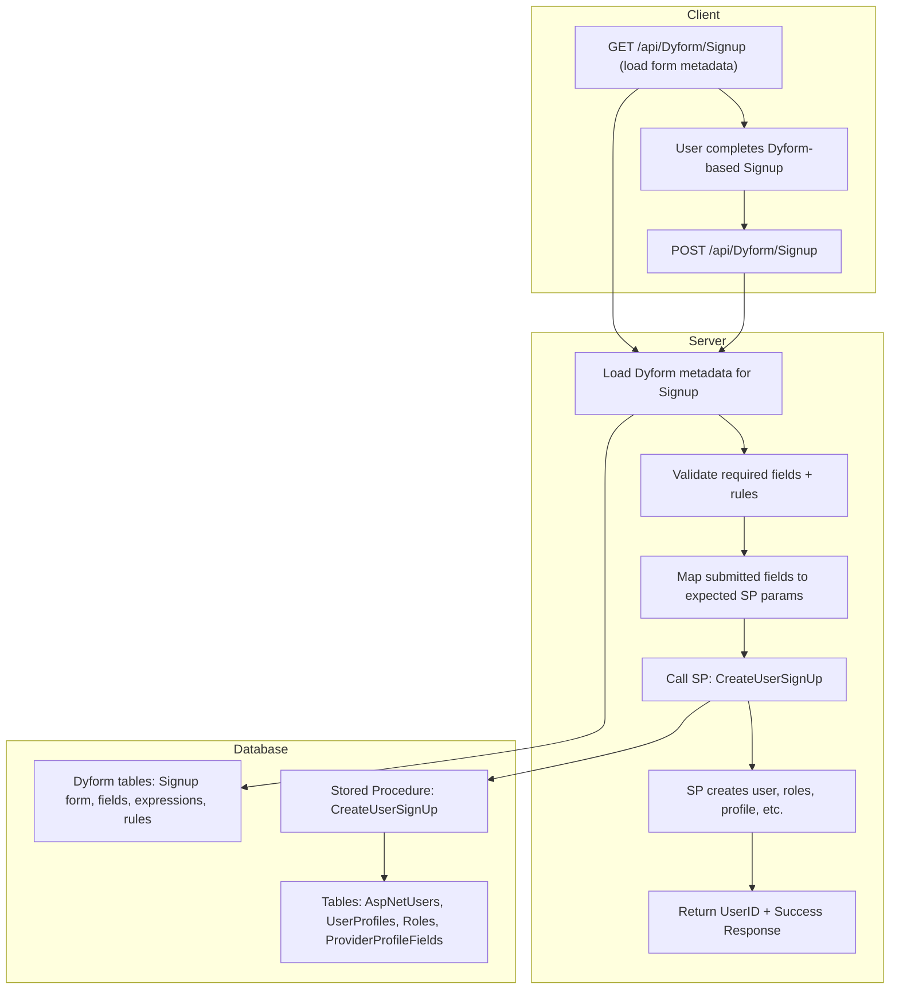
``` mermaid

flowchart TD

%% === CLIENT ===
subgraph Client
    A["User completes Dyform-based Signup"]
    A0["GET /api/Dyform/Signup (load form metadata)"]
    B["POST /api/Dyform/Signup"]
end

%% === SERVER ===
subgraph Server
    C["Load Dyform metadata for Signup"]
    D["Validate required fields + rules"]
    E["Map submitted fields to expected SP params"]
    F["Call SP: CreateUserSignUp"]
    G["SP creates user, roles, profile, etc."]
    H["Return UserID + Success Response"]
end

%% === DB ===
subgraph Database
    I["Dyform tables: Signup form, fields, expressions, rules"]
    J["Stored Procedure: CreateUserSignUp"]
    K["Tables: AspNetUsers, UserProfiles, Roles, ProviderProfileFields"]
end

%% Flow
A0 --> A --> B --> C --> D --> E --> F --> G --> H
A0 --> C
C --> I
F --> J
J --> K


```


---

## 🧱 Example DyformField Rows

```json
{
  "FieldName": "Email",
  "FieldTypeID": "5904E5B7-...",
  "ValueSourceTable": "AspNetUsers",
  "ValueSourceColumn": "Email",
  "ValueSourceKeyField": "ID",
  "IsRequired": true,
  "Placeholder": "Enter your email address"
},
{
  "FieldName": "MobilePhone",
  "ValueSourceTable": "UserProviderProfiles",
  "ValueSourceColumn": "FieldValue",
  "ValueSourceKeyField": "UserID, ProviderID, FieldID",
  "IsRequired": true,
  "Placeholder": "Mobile Contact"
}
```

---

## 🚦 Request Flow (GET /api/forms/:vmUserProfile_View)

1. Get all sections under `vm`
2. For each section, pull `DyformFields` with sort order
3. Resolve current values from their declared source tables/columns
4. Return shape:

```json
{
  "viewModel": "vmUserProfile_View",
  "userId": "abc123",
  "context": {
    "formName": "UserProfile",
    "resolver": {
      "method": "POST",
      "path": "/api/user/update-profile",
      "type": "UserProfileSubmission"
    },
    "template": "DefaultUserTemplate",
    "version": "v1.0"
  },
  "sections": [
    {
      "name": "Contact Info",
      "resolvers": [
        {
          "context": "load",
          "method": "GET",
          "type": "User",
          "target": "User.Email",
          "path": "/api/user/email"
        },
        {
          "context": "submit",
          "method": "PATCH",
          "type": "User",
          "target": "User.Email",
          "path": "/api/user/email"
        }
      ],
      "fields": [ ... ]
    }
  ]
}

```

# ✅ CRUD Stored Procedure (SP) Creation Guidelines

### **Objective**:  
Ensure consistency, security, and reusability when creating **CRUD (Create, Read, Update, Delete)** operations for the SkyLynx project.

---

### **1. General Guidelines for SP Creation**

- **Procedure Naming**:
  - Use the format: `Create<Entity>`, `Update<Entity>`, `Delete<Entity>`, `Get<Entity>ById`, `GetAll<Entity>`.
  - Entity should be the name of the table or resource being managed (e.g., `DyForm`, `DyFormRuleSyntax`, `UserProfile`, etc.).

  **Example**: `CreateDyForm`, `UpdateUserProfile`, `GetDyFormById`

- **Parameters**:
  - **Input Parameters**: These are values needed to interact with the database (e.g., fields for insertion or update).
  - **Output Parameters**: Use the `OUTPUT` keyword to return generated IDs (e.g., for new records created via `NEWID()`).

---

### **2. Create Procedure (Insert)**

**Purpose**: Insert a new record into a table.

- **Pattern**:
  - Always generate a new `uniqueidentifier` using `NEWID()` for the primary key field (`<Entity>Id`).
  - Use the `OUTPUT` clause to capture the `uniqueidentifier` (or other fields) generated during insertion and return it via the output parameter.

- **Example**:

```sql
CREATE PROCEDURE dbo.Create<Entity>
(
    @<Entity>Id UNIQUEIDENTIFIER OUTPUT,  -- Output for generated ID
    @<Field1> NVARCHAR(100),
    @<Field2> NVARCHAR(255) = NULL
)
AS
BEGIN
    SET NOCOUNT ON;

    -- Generate new uniqueidentifier
    SET @<Entity>Id = NEWID();

    -- Insert record
    INSERT INTO dbo.<Entity> (<Entity>Id, <Field1>, <Field2>)
    VALUES (@<Entity>Id, @<Field1>, @<Field2>);
END;
GO
```

- **Key Points**:
  - Use `NEWID()` to generate a new unique identifier for the primary key.
  - **Always include** the `OUTPUT` parameter to return the generated ID back to the caller.

---

### **3. Update Procedure (Modify Record)**

**Purpose**: Modify an existing record based on a unique identifier.

- **Pattern**:
  - The `WHERE` clause should reference the `uniqueidentifier` or other unique field to locate the record to update.
  - Always update the `UpdatedAt` timestamp to track when the record was last modified.

- **Example**:

```sql
CREATE PROCEDURE dbo.Update<Entity>
    @<Entity>Id UNIQUEIDENTIFIER,  -- The unique identifier for the record to update
    @<Field1> NVARCHAR(100),
    @<Field2> NVARCHAR(255) = NULL
AS
BEGIN
    SET NOCOUNT ON;

    -- Update record
    UPDATE dbo.<Entity>
    SET <Field1> = @<Field1>, <Field2> = @<Field2>, UpdatedAt = GETDATE()
    WHERE <Entity>Id = @<Entity>Id;
END;
GO
```

- **Key Points**:
  - Always use the unique identifier (`<Entity>Id`) to locate the record.
  - Include an `UpdatedAt` timestamp to maintain record history.

---

### **4. Delete Procedure (Remove Record)**

**Purpose**: Delete a record from the table.

- **Pattern**:
  - Use the `DELETE` statement to remove the record based on the provided unique identifier.
  - **Caution**: Ensure any dependencies (e.g., foreign keys) are handled correctly before deleting.

- **Example**:

```sql
CREATE PROCEDURE dbo.Delete<Entity>
    @<Entity>Id UNIQUEIDENTIFIER  -- The unique identifier for the record to delete
AS
BEGIN
    SET NOCOUNT ON;

    -- Delete record
    DELETE FROM dbo.<Entity>
    WHERE <Entity>Id = @<Entity>Id;
END;
GO
```

- **Key Points**:
  - Always delete based on a unique field (e.g., `uniqueidentifier`).
  - **Ensure referential integrity**: Handle foreign key constraints (either by cascading deletes or blocking delete if referenced elsewhere).

---

### **5. Get by ID Procedure (Fetch Specific Record)**

**Purpose**: Retrieve a single record based on its unique identifier.

- **Pattern**:
  - The `SELECT` statement should retrieve all relevant columns, using the unique identifier for the `WHERE` clause.

- **Example**:

```sql
CREATE PROCEDURE dbo.Get<Entity>ById
    @<Entity>Id UNIQUEIDENTIFIER  -- The unique identifier for the record
AS
BEGIN
    SET NOCOUNT ON;

    -- Retrieve the record by ID
    SELECT <Entity>Id, <Field1>, <Field2>, CreatedAt, UpdatedAt
    FROM dbo.<Entity>
    WHERE <Entity>Id = @<Entity>Id;
END;
GO
```

- **Key Points**:
  - Return all necessary fields (use `SELECT *` cautiously, prefer explicit column names).
  - **Handle NULLs**: Make sure the procedure properly returns empty results if the record does not exist.

---

### **6. Get All Procedure (Fetch Multiple Records)**

**Purpose**: Retrieve all records, optionally with filtering or pagination.

- **Pattern**:
  - For large datasets, implement **pagination** to limit the number of records returned.
  - Add optional `WHERE` clauses or sorting criteria based on business requirements.

- **Example**:

```sql
CREATE PROCEDURE dbo.GetAll<Entity>
AS
BEGIN
    SET NOCOUNT ON;

    -- Retrieve all records
    SELECT <Entity>Id, <Field1>, <Field2>, CreatedAt, UpdatedAt
    FROM dbo.<Entity>;
END;
GO
```

- **Key Points**:
  - You can extend this procedure to accept filtering criteria, for example, by adding `WHERE` clauses or `ORDER BY` statements.
  - **Pagination** can be added to improve performance with large datasets by using `OFFSET` and `FETCH`.

---

### **7. Error Handling**

- **`TRY...CATCH` Blocks**:
  - Always wrap the SQL statements in `TRY...CATCH` blocks to handle errors gracefully.

  **Example**:

  ```sql
  BEGIN TRY
      -- SQL logic here
  END TRY
  BEGIN CATCH
      PRINT ERROR_MESSAGE();  -- Log or throw error
      ROLLBACK TRANSACTION;   -- If inside a transaction
  END CATCH;
  ```

---


---

## ✨ Advantages
- React/Redux friendly for dynamic rendering
- Keeps all field logic abstracted from views
- SQL source decoupling: values can be in `AspNetUsers`, `UserProfiles`, or `CustomFieldValue` tables
- Views (`vw_UserProfile_*`) still usable via `DyformSection.ViewName`

---

## 🛣️ Future Features
- Field-level schema versioning
- Role-based visibility/requirement rules
- Auditing + change history
- Multi-field validation logic (e.g. min/max range)
- Tabbed UI or collapsible field sections
- Bulk row update APIs (PATCH /bulk)

---

Let me know if you'd like to:
- Start DDL and SP creation
- Wire this into an endpoint
- Build sample Dyform in the database (UserProfile)
- Migrate current `ProviderProfileField` into this structure

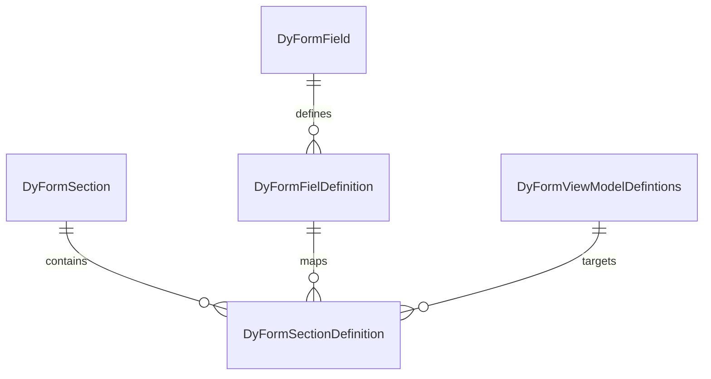
``` mermaid
erDiagram
    DyFormField ||--o{ DyFormFielDefinition : defines
    DyFormSection ||--o{ DyFormSectionDefinition : contains
    DyFormFielDefinition ||--o{ DyFormSectionDefinition : maps
    DyFormViewModelDefintions ||--o{ DyFormSectionDefinition : targets
```


### Server Design

  ``` mermaid
flowchart TD
  UI["React Client"]
  UI -->|GET /api/dform/viewmodel/UserProfile| Controller

  Controller --> Factory
  Factory --> Builder
  Builder --> Repository
  Repository -->|SP Calls| Database

  Builder --> Factory
  Factory -->|Final Output| UI
```

| Field Label           | DyFormFieldID                            | SourceKey         | DyFormDSDefinitionID                       | TableName     |
|----------------------|-------------------------------------------|-------------------|--------------------------------------------|---------------|
| User ID              | 45DC9A84-4F95-4F99-A347-259CEF7CCA00     | UserID            | 598B782D-0BDE-4731-AE2C-4EE0B919474B       | AspNetUsers |
| Phone Confirmed      | 7253B9C3-D631-4E69-9B69-2B493662DB0F     | PhoneConfirmed    | C8D2E2BC-33AD-444C-9B44-074751377775       | AspNetUsers |
| Phone                | D2462C27-34A2-4CA3-83AA-DD0858FD7DCA     | PhoneNumber       | 405D82D8-86B6-47C3-AAD2-8A0B243EC0BA       | AspNetUsers |
| User Name            | ABF9E2D2-71F4-439D-BE18-9284BFD347C2     | UserName          | D4CA7736-5DB4-4FDD-9C93-6DBDC990BD49       | AspNetUsers |
| Email                | 9B7A62E1-1BCE-47AC-BB0C-C3720DEB9289     | Email             | 0E8E640D-911A-4DC3-9693-B203DBE658F9       | AspNetUsers |
| Security Stamp       | 185DC9C5-9560-4A68-B3F2-C736A78514A1     | SecurityStamp     | D20A6CAB-207C-4B13-88D2-9C2F96F71D00       | AspNetUsers |
| Access Failed Count  | 35ECA553-EAB8-49A5-9318-C97CB6764563     | AccessFailedCount | BCB6B2E5-23D2-4EC5-9584-64CFA68C8AA3       | AspNetUsers |
| Lockout Enabled      | CCBB35C8-AA1C-4D17-92C3-CA219BEAB0B4     | LockoutEnabled    | 30DD3653-5EC8-4E36-B4D4-0C4E4F9E4A0B       | AspNetUsers   |
| Two-Factor Enabled   | 552F169A-7F77-4EF0-990E-D9FEC3867D07     | TwoFactorEnabled  | 38160382-98B2-494A-A561-53B43EBF7DB7       | AspNetUsers   |
| Email Confirmed      | 86435237-9F68-4E1C-A0B8-F60405E1208B     | EmailConfirmed    | AD3AD5FC-5B1B-4FD9-AE4F-5904850FC1E8       | AspNetUsers   |


# Desing Notes:

> everything in this section is random thoughts during Dev once done refactor design and update document with poper design changes

  ``` mermaid
flowchart TD
    subgraph SQL Server
        A["SkylynxPortalViewModelTree SP"]
        B["DyFormFieldSectionDefinition (with SortOrder)"]
        C["ProtosTemplateViewModels"]
    end

    subgraph Server
        D["getProtosTreeViewModelConfig()"]
        E["mapTreeFromResultSets()"]
        F["DyForm Builder (Factory.load(viewModel))"]
    end

    A -->|uses SortOrder| B
    A -->|returns ViewModel + Variant rows| D
    D --> E --> F
```


  ``` mermaid
erDiagram
  DyFormViewModelDefinition ||--o{ DyFormFieldSectionDefinition : has
  DyFormFieldSectionDefinition }o--|| DyFormSection : references
  DyFormSection ||--o{ DyFormSectionField : has
  DyFormSectionField }o--|| DyFormField : references
  DyFormField }o--|| DyFormFieldType : has
```

✅ Updated Pattern Name: ContainerBuilder
Here’s how that affects our architectural thinking:

  Layer	Builder/Pattern	Responsibility
  🧱 Individual VM	ViewModelBuilder	Builds sections + fields for a single ViewModel
  🧩 Composite VM	ContainerBuilder	Traverses the full tree, assembles all children
  🏭 Factory	FormBuilderFactory	Instantiates the correct builder (either ViewModel or Container) based on the context

  
  ``` mermaid
flowchart TD

A[POST /api/viewmodel/vmUserProfile_Form] --> B[FormBuilderFactory]

subgraph Server Builders
    B --> C[ContainerBuilder]
    C --> D[Resolve DyForm layout from DyForm tables]
    C --> E[For each child ViewModel]
    E --> F[Resolve full ViewModelName e.g. vmUserProfile_View]
    F --> G[Find SP in ProtosViewModelResolver]
    G --> H[Run SP, return data]
    H --> I[ViewModelBuilder creates sections, fields]
    I --> J[Attach to parent Container]
end

J --> Z[Return full DyFormViewModel with data]
```
## Server flow

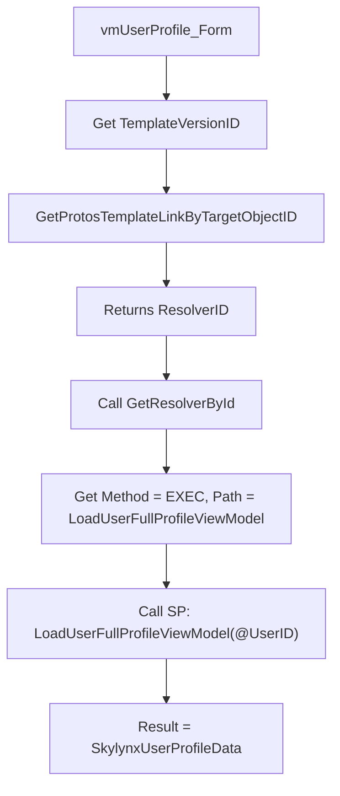
``` mermaid
flowchart TD

A["vmUserProfile_Form"] --> B["Get TemplateVersionID"]
B --> C["GetProtosTemplateLinkByTargetObjectID"]
C --> D["Returns ResolverID"]
D --> E["Call GetResolverById"]
E --> F["Get Method = EXEC, Path = LoadUserFullProfileViewModel"]
F --> G["Call SP: LoadUserFullProfileViewModel(@UserID)"]
G --> H["Result = SkylynxUserProfileData"]
```


# 🌐 NimbusCore API Route Design

## 📦 Overview

The NimbusCore API is divided into **two primary categories**:

1. **Runtime Operations** — APIs used at runtime to load and process forms, tied to the current authenticated portal/module via API key.
2. **Template Configuration** — APIs used to manage templates, portals, and module metadata. These are part of the admin tooling.

---

## ✅ Current Routes

### `POST /api/nimbus/forms/loadform`

- **Purpose**: Loads a full portal-specific form.
- **Includes**:
  - Form metadata (sections, fields, layout)
  - Data model (preloaded values)
  - Configuration template info (resolver, version, etc.)
- **Request Example**:
  ```json
  {
    "templateName": "tmpUserProfileForm",
    "portalName": "SkyLynxNet",
    "moduleName": "UserManagement",
    "params": [
      { "key": "userID", "value": "SKYX-000002" }
    ]
  }
  ```

---

## 🔮 Planned Routes

These will manage metadata used to configure forms, modules, and portals in a decoupled and reusable way.

### `GET /api/nimbus/templates/forms/`

- View or manage all registered form templates (`ProtosTemplate`, `ProtosTemplateVersion`)
- Supports filtering by portal, module, etc.

### `GET /api/nimbus/templates/portals/`

- Manage registered portals (`Portals` table)
- Used for assigning branding, domains, etc.

### `GET /api/nimbus/templates/modules/`

- Manage application modules (e.g., `UserManagement`, `Billing`, `Staking`)
- Supports assigning modules to portals via `PortalModules`

---

## 📁 Suggested File Structure

```bash
/routes/api/nimbus/
  ├── forms/
  │   └── loadForm.ts
  └── templates/
      ├── forms/
      ├── portals/
      └── modules/
```

---

## 🧠 Design Principles

- **Portal-aware by default**: All runtime routes are tied to the requesting portal via API Key. No need to include `/portals/` in runtime paths.
- **Metadata-driven**: All forms are resolved via `templateName` → `ViewModel` → `SPs + DyForm metadata`.
- **Version-ready**: Template versioning is built-in (`ProtosTemplateVersion`).
- **Extensible**: The route design supports dynamic schema injection, variant-based rendering, and multi-portal scalability.

---

Let me know when you're ready to implement or document these further — this structure will support everything you’ve been building with minimal refactor later.
 ## Skylynx Dynamic Form System Design Document

### Overview
The Skylynx platform uses a metadata-driven architecture to dynamically construct forms and resolve data from backend services. At the heart of this system lies the `NimbusCoreFactory`, responsible for interpreting `SkylynxPortalConfig` trees and assembling DyForm view models.

---

### ☁️ Core Design Principles

- **Metadata-Driven**: Forms and view models are not hardcoded, but instead defined through metadata records in SQL Server.
- **Stored Procedure First**: All data resolution should occur via stored procedures defined in metadata.
- **Dynamic Binding**: SP result sets are mapped to view models using DataModelDefinitions rather than manual mappings.
- **Caching**: `SkylynxPortalConfig` trees are cached in-memory per portal to optimize performance.

---

### 🧠 Key Components

| Component | Description |
|----------|-------------|
| `SkylynxPortalConfig` | Metadata tree of view models, templates, and resolver targets |
| `DyFormViewModel` | JSON structure for client-side rendering of a form |
| `ProtosTemplateLink` | Connects templates to resolvers and result data model definitions |
| `ProtosDataModelDefinition` | Defines the expected structure of SP result sets |
| `NimbusCoreFactory` | Orchestrates metadata loading, resolver execution, and value mapping |

---

### 🔁 NimbusCoreFactory Lifecycle

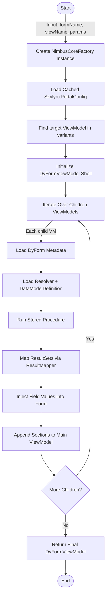
```mermaid
flowchart TD
    Start([Start]) -->|Input: formName, viewName, params| Init["Create NimbusCoreFactory Instance"]
    Init --> LoadTree["Load Cached SkylynxPortalConfig"]
    LoadTree --> GetTarget["Find target ViewModel in variants"]
    GetTarget --> InitVM["Initialize DyFormViewModel Shell"]
    InitVM --> IterateChildren["Iterate Over Children ViewModels"]

    IterateChildren -->|Each child VM| LoadMeta["Load DyForm Metadata"]
    LoadMeta --> LoadResolver["Load Resolver + DataModelDefinition"]
    LoadResolver --> RunSP["Run Stored Procedure"]
    RunSP --> MapResult["Map ResultSets via ResultMapper"]
    MapResult --> InjectValues["Inject Field Values into Form"]
    InjectValues --> AppendSection["Append Sections to Main ViewModel"]
    AppendSection --> CheckNext{"More Children?"}
    CheckNext -->|Yes| IterateChildren
    CheckNext -->|No| ReturnVM["Return Final DyFormViewModel"]
    ReturnVM --> End([End])
```

---

### 🔗 Result Mapping Process

Each resolver in `ProtosTemplateLink` must also reference a `DataModelDefinitionID` that points to a JSON record in `ProtosDataModelDefinition`, like:

```json
{
  "aspNetUserModel": [],
  "mailingAddressModel": [],
  "billingAddressModel": [],
  "providerProfileFieldModel": [],
  "providerProfileValueModel": []
}
```

This record is parsed and passed into `ResultMapper.mapFormData()` to strongly bind dynamic SP results to structured keys expected by the UI.

---

### 🧩 ResultMapper Pattern

```ts
mapFormData(
  recordsets: unknown[],
  dataModelDefinition: Record<string, string>
): SkylynxDataModelRecords
```

Returns a generic object like:

```ts
{
  aspNetUserModel: [{ ... }],
  billingAddressModel: [{ ... }],
  ...
}
```

---

### ✅ Next Implementation Steps

1. Create repository method: `getDataModelDefinitionByID(id)`
2. Refactor factory to use this JSON definition instead of inline `fields`
3. Update cache logic to ensure definitions are reused per portal
4. Finish logging and error handling for debug clarity

---

### 📦 Output Example: DyFormViewModel

```json
{
  "viewModel": "UserProfile_View",
  "portalName": "Skylynx",
  "moduleName": "UserManagement",
  "context": {
    "formName": "UserProfile",
    "template": "BaseUserTemplate",
    "version": "1.0"
  },
  "sections": [
    {
      "name": "User Info",
      "label": "Personal Details",
      "fields": [ ... ]
    },
    ...
  ]
}
```
---
# Payements schema
We want a clean relational model with real FK integrity, not stringy blobs. The pattern you’re reaching for is:

DDD Bounded Context + Aggregate Root (PaymentIntent)

Transaction Log (append-only PaymentTxn)

Outbox/Event Log (PaymentWebhook)

Associative Target Link (so we don’t do polymorphic columns in the core table)

Below is a tight, normalized Payments schema that “lives in the Payments module,” with a clean target relationship to whatever domain object (forms, orders, subscriptions) without polluting Protos.

## ERD — Payments
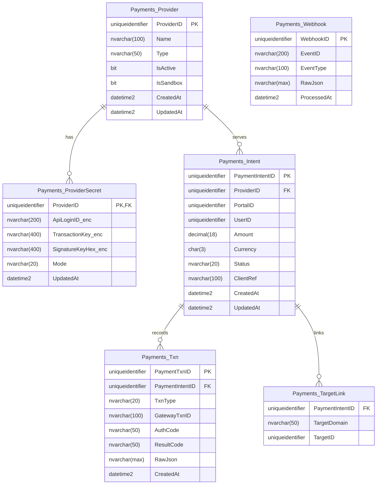
```mermaid
erDiagram
  Payments_Provider ||--o{ Payments_ProviderSecret : has
  Payments_Provider ||--o{ Payments_Intent : serves
  Payments_Intent ||--o{ Payments_Txn : records
  Payments_Intent ||--o{ Payments_TargetLink : links
  Payments_Webhook {
    uniqueidentifier WebhookID PK
    nvarchar(200) EventID
    nvarchar(100) EventType
    nvarchar(max) RawJson
    datetime2 ProcessedAt
  }
  Payments_Provider {
    uniqueidentifier ProviderID PK
    nvarchar(100) Name
    nvarchar(50)  Type
    bit           IsActive
    bit           IsSandbox
    datetime2     CreatedAt
    datetime2     UpdatedAt
  }
  Payments_ProviderSecret {
    uniqueidentifier ProviderID PK, FK
    nvarchar(200) ApiLoginID_enc
    nvarchar(400) TransactionKey_enc
    nvarchar(400) SignatureKeyHex_enc
    nvarchar(20)  Mode
    datetime2     UpdatedAt
  }
  Payments_Intent {
    uniqueidentifier PaymentIntentID PK
    uniqueidentifier ProviderID FK
    uniqueidentifier PortalID
    uniqueidentifier UserID
    decimal(18)  Amount
    char(3)        Currency
    nvarchar(20)   Status
    nvarchar(100)  ClientRef
    datetime2      CreatedAt
    datetime2      UpdatedAt
  }
  Payments_TargetLink {
    uniqueidentifier PaymentIntentID FK
    nvarchar(50)    TargetDomain
    uniqueidentifier TargetID
  }
  Payments_Txn {
    uniqueidentifier PaymentTxnID PK
    uniqueidentifier PaymentIntentID FK
    nvarchar(20)     TxnType
    nvarchar(100)    GatewayTxnID
    nvarchar(50)     AuthCode
    nvarchar(50)     ResultCode
    nvarchar(max)    RawJson
    datetime2        CreatedAt
  }
  

```
---
## State machine — PaymentIntent lifecycle

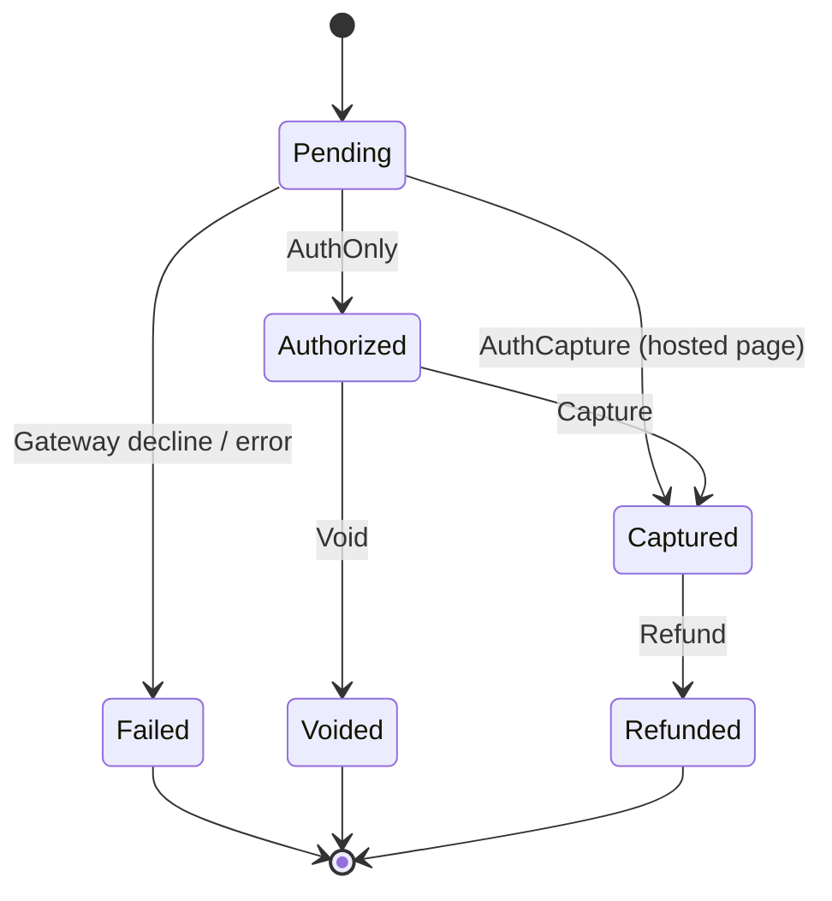
```mermaid
stateDiagram-v2
  [*] --> Pending
  Pending --> Authorized: AuthOnly
  Pending --> Captured: AuthCapture (hosted page)
  Pending --> Failed: Gateway decline / error
  Authorized --> Captured: Capture
  Authorized --> Voided: Void
  Captured --> Refunded: Refund
  Failed --> [*]
  Voided --> [*]
  Refunded --> [*]
```
---
## Sequence — Payments Tables Schema

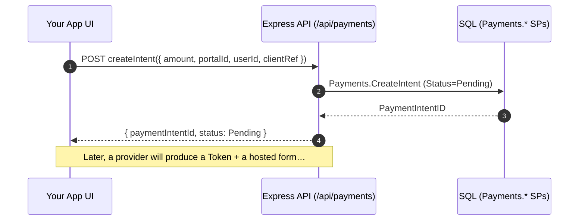
```mermaid
sequenceDiagram
  autonumber
  participant UI as Your App UI
  participant API as Express API (/api/payments)
  participant DB as SQL (Payments.* SPs)

  UI->>API: POST createIntent({ amount, portalId, userId, clientRef })
  API->>DB: Payments.CreateIntent (Status=Pending)
  DB-->>API: PaymentIntentID
  API-->>UI: { paymentIntentId, status: Pending }

  Note over UI,API: Later, a provider will produce a Token + a hosted form…
```
---

## Authorize.Net SDK (server + gateway)
> We wrap the SDK behind a PaymentProvider facade so SkyLynx only talks to typed interfaces. Internally we use the Authorize.Net REST (or SDK) to:

>Create Hosted Payment Token (getHostedPaymentPageRequest)

>Receive Webhooks (HMAC check with Signature Key)

>Map events back to Payments.Intent and append Payments.Txn

### Component view — how it fits on the server
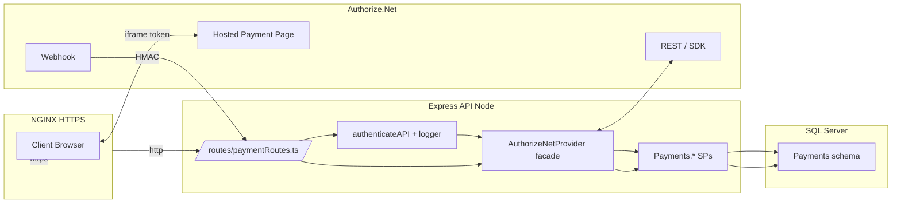
```mermaid
flowchart LR
  subgraph NGINX [NGINX HTTPS]
    direction LR
    C[Client Browser]
  end

  subgraph Express [Express API Node]
    direction TB
    R1[/routes/paymentRoutes.ts/]
    MW[authenticateAPI + logger]
    Prov[AuthorizeNetProvider facade]
    SPs[Payments.* SPs]
  end

  subgraph SQL [SQL Server]
    DB[Payments schema]
  end

  subgraph ANet [Authorize.Net]
    HPP[Hosted Payment Page]
    API[REST / SDK]
    WH[Webhook]
  end

  C -- https --> NGINX -- http --> R1
  R1 --> MW --> Prov
  Prov --> SPs --> DB
  Prov <--> API
  C <-- iframe token --> HPP
  WH -- HMAC --> R1
  R1 --> Prov --> SPs --> DB
```
---
### End-to-end flow with Authorize.Net (hosted page)

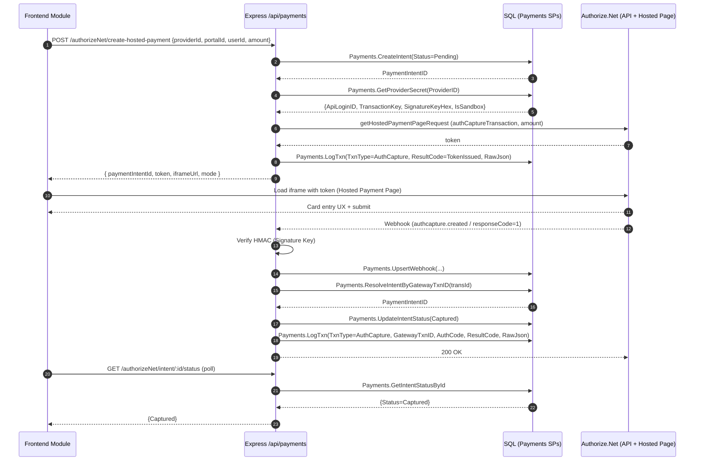
```mermaid
sequenceDiagram
  autonumber
  participant UI as Frontend Module
  participant API as Express /api/payments
  participant SP as SQL (Payments SPs)
  participant AN as Authorize.Net (API + Hosted Page)

  UI->>API: POST /authorizeNet/create-hosted-payment {providerId, portalId, userId, amount}
  API->>SP: Payments.CreateIntent(Status=Pending)
  SP-->>API: PaymentIntentID
  API->>SP: Payments.GetProviderSecret(ProviderID)
  SP-->>API: {ApiLoginID, TransactionKey, SignatureKeyHex, IsSandbox}
  API->>AN: getHostedPaymentPageRequest (authCaptureTransaction, amount)
  AN-->>API: token
  API->>SP: Payments.LogTxn(TxnType=AuthCapture, ResultCode=TokenIssued, RawJson)
  API-->>UI: { paymentIntentId, token, iframeUrl, mode }

  UI->>AN: Load iframe with token (Hosted Payment Page)
  AN-->>UI: Card entry UX + submit

  AN-->>API: Webhook (authcapture.created / responseCode=1)
  API->>API: Verify HMAC (Signature Key)
  API->>SP: Payments.UpsertWebhook(...)
  API->>SP: Payments.ResolveIntentByGatewayTxnID(transId)
  SP-->>API: PaymentIntentID
  API->>SP: Payments.UpdateIntentStatus(Captured)
  API->>SP: Payments.LogTxn(TxnType=AuthCapture, GatewayTxnID, AuthCode, ResultCode, RawJson)
  API-->>AN: 200 OK

  UI->>API: GET /authorizeNet/intent/:id/status (poll)
  API->>SP: Payments.GetIntentStatusById
  SP-->>API: {Status=Captured}
  API-->>UI: {Captured}

```
### Why this is rational & future-proof (quick spar)

Tight relational core (Intent/Txn/Webhook/TargetLink) → clean FKs, auditability, refunds/voids later without redesign.

Provider abstraction → Authorize.Net today, Stripe tomorrow, no ripple into domain code.

PCI-minimized → hosted page + HMAC webhooks; store only IDs/last4/brand; secrets in ProviderSecret.

Form-agnostic → link to DyForm submissions only when needed via TargetLink; Payments stands alone.

### Payyments Seedindg Process

```mermaid
flowchart TD
    subgraph Protos Layer
    Tmpl[ProtosTemplate]
    TmplVer[ProtosTemplateVersion]
    TmplLink[ProtosTemplateLink]
    end

    subgraph Portal Layer
    Mod[Modules]
    Page[PageDefinition]
    PPM[PortalPageModules]
    end

    subgraph Payments Layer
    Prov[Payments.Provider]
    Secret[Payments.ProviderSecret]
    Intent[Payments.Intent]
    TLink[Payments.TargetLink]
    Txn[Payments.Txn]
    Webhook[Payments.Webhook]
    end

    Tmpl --> TmplVer --> TmplLink
    Mod --> PPM
    Page --> PPM
    PPM --> TmplLink

    Prov --> Secret
    Prov --> Intent
    Intent --> TLink
    Intent --> Txn
    Webhook --> Intent

```
## Overview: “Webhook Journey"

``` mermaid
sequenceDiagram
    participant ANet as Authorize.Net
    participant NGINX as NGINX (HTTPS terminator)
    participant Express as Skylynx API (payments route)
    participant Provider as AuthorizeNetProvider
    participant DB as SQL Server (Payments schema)

    ANet->>NGINX: HTTPS POST /api/payments/webhook
    NGINX->>Express: Forward request body and signature header
    Express->>Provider: call processWebhook(rawBody, signatureHeader)
    Provider->>Provider: verify signature (HMAC-SHA512)
    Provider->>DB: EXEC Payments.UpsertWebhook(...)
    Provider->>DB: EXEC Payments.ResolveIntentByGatewayTxnID(...)
    Provider->>DB: EXEC Payments.UpdateIntentStatus(...)
    Provider->>DB: (optional) EXEC Payments.RecordTxn(...)
    Provider-->>Express: { ok: true }
    Express-->>NGINX: 200 OK
    NGINX-->>ANet: 200 OK (stops retries)

```

---


### ✍️ Notes
- This update supports better decoupling of logic and more robust dynamic mapping.
- Forms can now evolve independently from their SPs.
- This approach is essential for multi-portal, multi-tenant systems.

---
Protos layer (a minimal ProtosTemplate + ProtosTemplateVersion + ProtosTemplateLink)


## Server Install and Settings UI Plan

### Objective

The SkyLynx server should be able to bootstrap itself on a new machine when no configured SQL database is available. The first-run flow will expose a server-hosted install page that collects database connection information, validates SQL Server access, installs the required database files, and optionally seeds sandbox/test data.

This is planned as a server administration experience, separate from normal portal/client workflows.

### First-Run Install Path

When the server starts, it should check whether the required databases and core tables exist. If the check fails, the server should enter install mode and expose an install page.

Planned route:

```text
/install
```

The install page should be built with MUI, matching the client application's design system. The page should guide the user through:

1. SQL Server connection settings.
2. Connection test.
3. Database install selection.
4. Seed choice.
5. Install execution and progress.
6. Final server settings write.

### Database Install Sources

Database install files now live under:

```text
src/data/core
src/data/core/seed
src/data/portal
src/data/portal/seed
```

Core database:

```text
Database: skylynxnet_coredb
Install runner: src/data/core/install_core.sql
Seed runner: src/data/core/seed/seed_core.sql
```

Portal template database:

```text
Database: skylynx_portal_template
Install runner: src/data/portal/install_portal.sql
Seed runner: src/data/portal/seed/seed_portal.sql
```

Install order should be:

1. Core database.
2. Portal template database.

The current server uses both databases conceptually, and core should be treated as the foundation for identity, portal registration, Protos, DyForm, payments, settings, and shared reference data.

### Seed Options

The installer should offer two modes:

```text
Build fresh
Seed sandbox data
```

Build fresh installs schema, stored procedures, views, triggers, and relationships without test records.

Seed sandbox data installs schema first, then runs the seed scripts exported from the current sandbox databases. This is useful for spinning up a new SQL test machine with the same development metadata and sample data.

### Settings Page

After install, the server should expose a protected settings page for changing server-level configuration.

Planned route:

```text
/settings
```

Initial settings areas:

- SQL Server connection settings.
- Core database name.
- Portal template database name.
- API/server port and public base URL.
- Logging level.
- Install status and database health checks.
- Payment provider mode and webhook URL checks.
- Backup/restore or export status.

Settings should not be mixed into normal portal user pages. This should be an admin-only server operation surface.

### Database Settings and Rollover

Future settings should support database rollover/fallback planning. The goal is not full clustering yet, but the design should leave room for:

- Primary SQL Server connection.
- Secondary/fallback SQL Server connection.
- Read-only health checks for both.
- Manual failover setting.
- Future automatic failover policy.
- Last successful connection timestamp.
- Database schema version tracking.

These settings should be persisted outside the databases they configure so the server can still enter install/settings mode if the configured DB is unavailable. Candidate storage:

```text
.env for local development
server settings JSON for installer-managed configuration
encrypted secret store later for production credentials
```

### Install Mode Safety

Install mode should be explicit and constrained:

- Do not run schema installs automatically against an existing database without confirmation.
- Show the target server and database names before executing.
- Keep schema install and seed install as separate steps.
- Prefer fresh databases for build-from-scratch installs.
- Log every install step to console and server logs.
- Never expose the install/settings pages publicly after setup without admin authentication.

### Future Schema Organization Note

The current core database mostly uses `dbo`, with `Payments` already separated into its own schema. During a future refactor, consider moving major domains into clearer schemas:

```text
Identity
Portal
Protos
DyForm
Payments
Audit
Reference
```

This should be treated as a migration project because it will affect tables, views, stored procedures, seed scripts, TypeScript service calls, and hard-coded SQL object names.


_Last updated: 2025-07-05_
