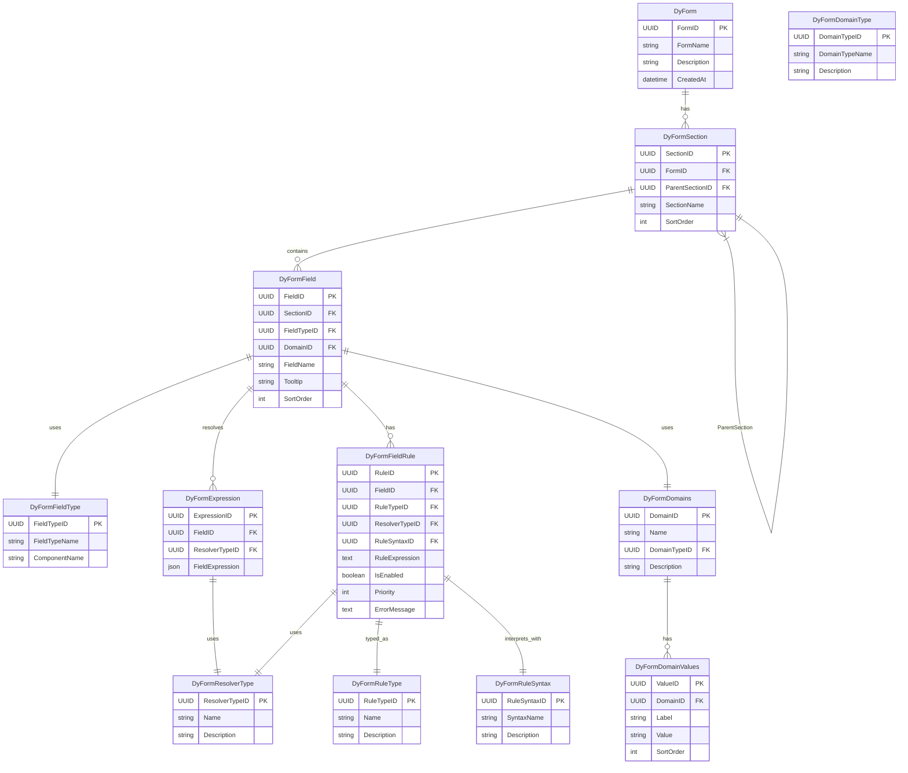

# Skylynx Server with Express.js and Nginx

## Overview

This project sets up a basic Express.js server with an Nginx reverse proxy using Docker Compose.

### Directory Structure
- `skylynx-express/`: Contains the Express.js application.
- `nginx/`: Contains the Nginx configuration.
- `docker-compose.yml`: Orchestrates the services.

### How to Run

1. Build and start the containers:
   ```bash
   docker-compose up --build
   ```

2. Access the application:
   - Open your browser and navigate to [http://localhost](http://localhost).
### SQL SererAPI
Here you can use this api to create apps,portals and websites and manage all of the users for those websites

### Notes
- Modify the `.env` file in the `skylynx-express/` folder to configure the database connection.
- Extend the `server.js` file to include additional API endpoints.

## Test High volumn

``` bash 
seq 1 1000 | xargs -n1 -P50 curl -s http://skylynxnet:5001/
```
and 

``` bash 
seq 1 1000 | xargs -n1 -P50 curl -s http://skylynxnet:8080/
```

## Test Sql 

adminUser
u:admin 
e: contact@cryptoriomarket.com
p:khaosrules4$ - Hash'$2b$12$bePn6NudkKtYKhFJpl/dRuFHFxK1Udfe2B01aTtMuMsgKerUTZIPW'

testUser
u:testuser
p:testingrules4$ ''
Aother Test User
"email": "kurickabides@gmail.com",
password": "!khaosrules"

# **📌 SkyLynx Database & API Design Documentation**

## **📌 1. Overview**
SkyLynx is a **modular portal system** designed to handle **user authentication, API management, payments, and subscriptions** while enabling **multi-tenant portals** with dynamically assigned modules.

This document outlines the **database schema, stored procedures, views, and security considerations** for the system.

---

## **📌 2. Database Schema**
SkyLynx consists of multiple interrelated tables that support users, roles, portals, modules, API keys, payments, and transactions.

### **📊 Entity-Relationship Diagram (ERD)**


### **📌 3. Key Tables & Relationships**

| **Table Name** | **Purpose** |
|--------------|------------|
| `AspNetUsers` | Stores user authentication data. |
| `UserProfiles` | Holds additional user data (OAuth, billing, etc.). |
| `AspNetUserRoles` | Maps users to roles. |
| `Portals` | Represents different portals (e.g., SkyLynx.net, SkyLynx.live). |
| `Modules` | Defines system features (CRM, IoT, etc.). |
| `PortalModules` | Links modules to specific portals. |
| `API_KEYS` | Manages API access for users, portals, and modules. |
| `Transactions` | Logs financial transactions. |
| `PaymentMethods` | Stores user payment methods. |
| `SubscriptionPlans` | Tracks user subscriptions. |
| `SystemLogs` | Records security and system events. |

---

## **📌 4. Stored Procedures (SPs)**
Stored procedures handle **data management, security, and API calls** efficiently.

### **📌 CRUD Procedures**
| **SP Name** | **Purpose** |
|------------|------------|
| `CreateUser` | Creates a new user. |
| `UpdateUser` | Updates user details. |
| `DeleteUser` | Removes a user. |
| `GetUserById` | Retrieves user information. |
| `CreatePortal` | Creates a new portal. |
| `AssignModuleToPortal` | Links a module to a portal. |
| `CreateTransaction` | Logs a new transaction. |
| `CancelSubscription` | Cancels a user's subscription. |

### **📌 Security & Authentication Procedures**
| **SP Name** | **Purpose** |
|------------|------------|
| `GenerateApiKey` | Creates an API key for users/modules/portals. |
| `ValidateApiKey` | Checks API key validity. |
| `AssignUserRole` | Grants a user a role. |
| `RemoveUserRole` | Revokes a user role. |
| `CreateUserLogin` | Manages OAuth logins. |

---

## **📌 5. Views**
Views simplify **complex queries** by aggregating data for portals, users, transactions, and logs.

### **📌 Views & Their Purpose**
| **View Name** | **Description** |
|------------|------------|
| `vw_UserRoles` | Shows users and their roles. |
| `vw_UserProfiles` | Displays user profiles with linked OAuth providers. |
| `vw_PortalModules` | Lists modules assigned to portals. |
| `vw_ActiveAPIKeys` | Retrieves active API keys in the system. |
| `vw_UserTransactions` | Shows transaction details for each user. |
| `vw_SystemLogs` | Tracks system events and security logs. |


---

## **📌 6. Security Considerations**
SkyLynx prioritizes **security and compliance** by enforcing:
✔ **Role-Based Access Control (RBAC)** for system actions.  
✔ **Stored API Keys with hashing** to prevent unauthorized access.  
✔ **Encrypted payment methods and transactions**.  
✔ **Audit logging via `SystemLogs` to track all security events.**  

---

## 🧠 Design Principles

- 🔐 **Security First**: API keys are stored as SHA-256 hashes. All requests are authenticated via `skyx-api-key` and `skyx-portal-id` headers.
- 🏢 **Multi-Tenant Architecture**: Portals, users, modules, and API keys are decoupled for reusability and scaling.
- ♻️ **Reusability & Modularity**: Validation logic lives in SQL Server functions (`fn_IsValidAPIKey`) for performance and reuse.

---

## 🗃️ Database Design (ER Diagram)


## 📘 Dyform User Profile Design — Server Workflow and Data Exchange

---

### 🌟 Objective

Design a full end-to-end data architecture and workflow for retrieving and updating user profile information using the **Dyform** metadata-driven system.

We aim to dynamically generate user forms from metadata while resolving values from different source tables. This design document breaks down:

- Database table roles
- View vs. Field expressions
- Server responsibilities
- Client-side expectations (only inputs/outputs)
- API interaction workflows

---

### 📂 Key Tables Involved

## 🔁 Auth & API Flow

### 🔑 API Authentication Flow

1. Client sends headers:
   - `skyx-api-key`: **Plaintext key**
   - `skyx-portal-id`: **Portal name**

2. Server:
   - Hashes the API key.
   - Resolves portal name to PortalID via view.
   - Validates both values using SQL Server `fn_IsValidAPIKey`.

---

## 🧪 Sample Test Script (Linux/macOS)

### High-Volume Testing

```bash
seq 1 1000 | xargs -n1 -P50 curl -s http://localhost:3200/api/test-post -H "skyx-api-key: testkey123" -H "skyx-portal-id: SkyLynxNet" -d '{}'
```

### SQL Manual Validation (Example Only)

```sql
EXEC ValidateOwnerApiKey
    @PlainApiKey = '2EEBE1A1-23CD-4C16-96E7-567C02EF79EA',
    @PortalName = 'SkyLynxNet';
```
## 🔄 API Runtime Flow Diagram


---

### Example Data Table Sources

| Table                  | Role                                 |
| ---------------------- | ------------------------------------ |
| `AspNetUsers`          | Stores username, email, phone, etc.  |
| `UserProfiles`         | SkylynxNet-specific profile fields   |
| `UserProviderProfiles` | Dynamic field-value mapping          |
| `Address`              | Stores mailing and billing addresses |

---

# 📘 DyForm Design — Metadata-Driven Forms

## ❓ Why DyForm

SkyLynx uses the **DyForm** system to enable dynamic, metadata-driven form generation and management. Rather than hardcoding UI elements or database mappings, DyForm treats each form as a flexible composition of:

- **Sections** and **Fields** stored as metadata  
- **Expressions** that resolve where and how to get/set data  
- **Rules** that drive validation, visibility, and behavior

### ✅ Benefits

- **Dynamic UI Generation**  
  Forms are rendered based on metadata — no frontend code change needed to add or modify fields.

- **Multi-source Data Binding**  
  Fields can resolve from `AspNetUsers`, `UserProfiles`, `ProviderProfileFields`, or SPs — all declaratively.

- **Reusability & Portability**  
  With templated sections and versioning (via `Protos`), the same DyForm layout can be reused across portals or modules.

- **Separation of Concerns**  
  Business rules, data access, and UI structure are decoupled, aligning with **Builder**, **Strategy**, and **Interpreter** patterns.

- **SP-First Resolver Logic**  
  All field writes are directed through stored procedures, maintaining a secure and auditable architecture.

---

## 🧩 DyForm Tables (Metadata Only)

| **Table**               | **Description**                                                  |
|------------------------|------------------------------------------------------------------|
| `DyForm`               | Represents a logical form (e.g. `UserProfile`)                   |
| `DyFormSection`        | Subgroup of fields (e.g. `Contact Info`, `Billing Info`)         |
| `DyFormField`          | Each form field definition                                       |
| `DyFormExpression`     | Instructions on how to resolve value locations                   |
| `DyFormFieldType`      | Metadata about input type (e.g., `TextInput`, `EmailInput`)      |
| `DyFormDomains`        | Top-level metadata for field domains (value/range/etc.)          |
| `DyFormDomainValues`   | Key-value pairs for each defined domain                          |
| `DyFormFieldRule`      | Validation, visibility, and computed rules per field             |
| `DyFormRuleType`       | Master list for rule behavior types                              |
| `DyFormRuleSyntax`     | Defines how rule expressions are parsed and interpreted          |
| `DyFormResolverType`   | Lookup for how field values are resolved                         |
| `DyFormDomainType`     | Classifies types of domains (e.g., `range`, `value`, `regex`)    |

---

## 🧠 Schema Model




## 📐 Protos Template System — Design Overview

The **Protos** schema is the foundation for a flexible, version-controlled templating system that enables dynamic composition of Portals, Modules, Forms, and Pages within the SkyLynx architecture. It follows the **Prototype Pattern**, allowing templates to be cloned, extended, and versioned with lightweight references.

---

### 💡 Purpose

To define reusable structural blueprints (templates) that can be applied dynamically across:

- Form rendering (`DyForm` integration)
- Portal composition (dynamic layout generation)
- Module wiring and assignment

---

### 🧱 Core Tables (`Protos` Schema)


---

### 🔄 Relationship to `DyForm`

| `DyForm` Entity | Usage in `ProtosTemplateLink`                         |
| --------------- | ----------------------------------------------------- |
| `DyForm.FormID` | Linked via `TargetID` where `TargetTypeName = 'Form'` |
| `DyFormSection` | Not directly templated (inherits from form)           |
| `DyFormField`   | Defined by template lineage                           |

> Protos doesn’t replace `DyForm`, it wraps it with a reusable **template shell** for cloning and customization.

---

### 🧠 Design Advantages

- 📦 **Reuse-first**: Templates can be authored once, and reused across Portals, Modules, etc.
- 🧬 **Versioning**: Templates are immutable once published. Versions can be cloned and evolved.
- 🪞 **Prototype Pattern**: Templates derive structure from a parent while customizing behavior per usage.
- 🛠 **Dynamic Linking**: A `TemplateLink` determines when and where a template version is active.
- 🔀 **Form Flexibility**: `DyForm`-based forms can be plugged into Portals or Modules via Protos.

---

### ⚙️ Supporting Design Patterns (GoF + Data-Centric)

| Pattern                     | Role in Design                                                                    |
| --------------------------- | --------------------------------------------------------------------------------- |
| **Prototype**               | Core to template cloning/versioning (`ProtosTemplateVersion`, `Lineage`)          |
| **Composite**               | `DyFormSection` nesting inside `DyForm`, allowing recursive UI construction       |
| **Strategy**                | Resolvers/Rules as runtime-selected logic (`ResolverType`, `RuleType`)            |
| **Flyweight**               | Shared domain values/components (e.g., states, languages) via `DyFormDomains`     |
| **Bridge**                  | Linking templates to runtime targets (Portals, Modules, Forms) via `TemplateLink` |
| **Builder**                 | UI rendering builds sections from field metadata dynamically                      |
| **Chain of Responsibility** | Resolution flow: Expression → SP → View → Fallback Default                        |
| **State**                   | Draft → Published → Archived lifecycles of `ProtosTemplateVersion`                |
| **Observer**                | Future pattern to alert modules on template change via `TemplateChangeLog`        |
| **Interpreter**             | Parse and enforce rule expressions and field logic                                |
| **Decorator**               | Optional overrides applied at `TemplateLink` to customize reused templates        |

---

## ✅ Design Breakthrough: Reusable Sections & Multi-Parent Composition

> This section documents a critical architecture issue identified during the evolution of the SkyLynx Dyform system and the introduction of a templating system (`Protos`) that resolved it.

---

### ❗ Original Limitation in `DyFormSection`

In the initial `DyForm` schema:

```mermaid
erDiagram
  DyFormSection {
    UUID SectionID PK
    UUID ParentSectionID FK -- Self-referencing
    UUID FormID FK
    string SectionName
    int SortOrder
  }
```

- `DyFormSection` was structured as a **strict hierarchy** using `ParentSectionID`.
- This made sections **form-local and tightly coupled**, limiting reuse.
- The structure **enforced single-parent nesting**, so a section could not:
  - Appear in more than one parent section.
  - Be reused across multiple forms.

This became a blocker when common substructures like **Mailing Address** or **Billing Info** were needed in multiple forms or multiple places in the same form.

---

### 💡 Problem Statement

> “Mailing Address” should be able to exist **once**, but appear in **multiple parent contexts** — such as:
> - Under “User Info”
> - Under “Billing Info”
> - In multiple forms entirely

---

### ✅ Architectural Solution: `ProtosTemplate` System

The new `Protos` schema introduces a full **template-based composition** engine that:

- Detaches form logic from its static structure.
- Enables reusability and modularity through **template versions** and **template links**.

Key Components:

| Table                  | Role |
|------------------------|------|
| `ProtosTemplate`       | Defines the reusable structure (e.g., a form layout or component group). |
| `ProtosTemplateVersion` | Enables cloning and evolving templates safely over time. |
| `ProtosTemplateLink`   | Bridges templates to **targets** like `DyForm`, `Portal`, or `Module`. |

---

### 🧬 What This Enables

| Capability | Description |
|------------|-------------|
| ✅ Multi-parent Sections | A section like `Mailing Address` can be part of **multiple parents** via template structure. |
| ✅ Form Decomposition | Shared logic can live in base templates and be extended. |
| ✅ Reuse Across Forms | A single versioned template can be reused in different user flows. |
| ✅ Overrides per Context | Decorator pattern allows optional overrides at the link level. |

---

### 🔧 Patterns Applied

| Pattern | Role in Solution |
|---------|------------------|
| **Prototype** | Enables versioned templates that can be cloned and customized. |
| **Flyweight** | Promotes reuse of shared layout structures like address sections. |
| **Bridge** | Decouples structural templates from runtime targets. |
| **Composite** | Still used within a template (sections within sections), but no longer required for logic-level reuse. |
| **Decorator** | (Optional) For contextual overrides per use. |

---

### 📍 Where to Insert This

**Insert after this section in `Design.md`:**

> ## 📐 Protos Template System — Design Overview

**Insert before this section:**

> ## 🔄 API Runtime Flow Diagram

### 🧬 Data Modeling Patterns (DDD-inspired)

| Concept               | Application                                                           |
| --------------------- | --------------------------------------------------------------------- |
| **ViewModel**         | What client receives from `GET /api/Dyform/:formName` — clean UI shape |
| **Entity Model**      | Stored metadata from `DyForm` and `ProtosTemplate`                    |
| **Form Data Model**   | Values submitted from frontend → API (raw JSON + field/value pairs)   |
| **Validation Model**  | Encapsulated in `DyformFieldRule`, enforced at render and post-submit  |
| **Persistence Model** | SP-first design ensures reliable storage per resolver + table map     |

> These models are *decoupled* by intent. UI receives a ViewModel, but backend processes against a normalized Persistence Model.

---
API / Routes

---


Let me know if you'd like the SQL DDLs or SP scaffolds generated for `ProtosTemplate`, `ProtosTemplateVersion`, etc.


### 📥 GET Request — Load User Profile Form

### Route

`GET /api/Dyform/UserProfile/:userId`

### Server Flow


### What Server Does

1. Reads Dyform, DyformSections, and DyformFields for form `UserProfile`
2. Joins with `FieldType`, `DyformExpression`, and optionally `DyformDomainValues`
3. Parses each `DyformExpression.fieldExpression`
4. Resolves value from appropriate table using current `:userId`
5. Builds structured payload of field definitions **with resolved values**
6. Includes domain values if defined for dropdowns or validation lists
7. Evaluates applicable `DyformFieldRule` entries

### Response Example

```json
{
  "formName": "UserProfile",
  "sections": [
    {
      "name": "Contact Info",
      "fields": [
        {
          "fieldId": "abc-123",
          "label": "Email",
          "tooltip": "Enter email",
          "value": "user@example.com",
          "type": "EmailInput",
          "rules": [
            { "type": "isRequired", "value": true },
            {
              "type": "validation",
              "value": {
                "regex": "^\\S+@\\S+\\.\\S+$",
                "message": "Invalid email"
              }
            }
          ],
          "options": [
            { "label": "Work", "value": "work" },
            { "label": "Personal", "value": "personal" }
          ]
        }
      ]
    }
  ]
}
```

---

## 📝 PUT Request — Update User Profile

### Route

`PUT /api/Dyform/UserProfile/:userId`

### Client Sends

```json
{
  "formId": "form-guid",
  "sectionId": "section-guid",
  "fields": [
    {
      "fieldId": "abc-123",
      "value": "new@example.com"
    }
  ]
}
```

### Server Flow


### What Server Does

1. Loads metadata for each `fieldId`
2. Looks up associated `DyformExpression`
3. Decodes expression:
   ```json
   {
     "table": "AspNetUsers",
     "column": "Email",
     "keyField": "UserID"
   }
   ```
4. Constructs UPDATE statement:
   ```sql
   UPDATE AspNetUsers SET Email = 'new@example.com' WHERE Id = :userId;
   ```
5. Executes updates
6. Returns 200 OK or error

---

## 🧠 Advanced Notes

### Supported `resolverType`

| ResolverType | Use Case                       | Behavior                     |
| ------------ | ------------------------------ | ---------------------------- |
| `table`      | Direct column updates          | Standard `UPDATE`/`INSERT`   |
| `pivot`      | Field-value key mapping        | `UserProviderProfiles`-style |
| `sp`         | Stored procedure update/create | `EXEC sp_name`               |
| `dbFn`       | SQL function computed values   | Read-only                    |
| `sql`        | Custom SQL snippet (read-only) | `SELECT ... FROM ...`        |
| `json`       | Static client config           | JSON-only values             |
| `template`   | Text rendering helper          | Label substitution           |
| `function`   | Programmatic logic (future)    | App-controlled               |

### Domain Tables

#### `DyformDomains`

| Column     | Description                  |
| ---------- | ---------------------------- |
| DomainID   | Primary Key                  |
| Name       | Name of the domain           |
| DomainType | `value`, `range`, `regex`... |

#### `DyformDomainValues`

| Column    | Description   |
| --------- | ------------- |
| DomainID  | FK to domain  |
| Value     | Option value  |
| Label     | Option label  |
| SortOrder | Display order |

### Field Rules via `DyformFieldRule`

| RuleID | FieldID | RuleType     | ResolverType | RuleExpression                                   | Enabled | Priority | ErrorMessage        |
| ------ | ------- | ------------ | ------------ | ------------------------------------------------ | ------- | -------- | ------------------- |
| 1      | abc123  | `isRequired` | `json`       | `true`                                           | true    | 1        |                     |
| 2      | abc123  | `validation` | `json`       | `{ "regex": "^[0-9]{10}$" }`                     | true    | 2        | "Must be 10 digits" |
| 3      | abc123  | `isHidden`   | `json`       | `{ "if": {"field": "Role", "equals": "Admin" }}` | true    | 3        |                     |
| 4      | abc123  | `computed`   | `json`       | `{ "expr": "Lower(First + '.' + Last)" }`        | true    | 4        |                     |

---

## 📦 What Server Sends to Client

| Property     | Description                             |
| ------------ | --------------------------------------- |
| `formName`   | Name of form (e.g., `UserProfile`)      |
| `sections[]` | List of form sections                   |
| `fields[]`   | Per-section fields with resolved values |
| `options[]`  | Predefined values for select fields     |
| `rules[]`    | UI logic and validation rules           |
| `domains[]`  | List of domain sets and their options   |

---

## 🔁 What Client Sends Back

| Field       | Description                             |
| ----------- | --------------------------------------- |
| `formId`    | ID of form being edited                 |
| `sectionId` | ID of section being edited              |
| `fields[]`  | Array of `{ fieldId, value }` to update |

---
### User Profile SetUp 
Below is a table that outline the configuration setup of Portal gives a good example of how our DyForm system will dynamically build forms for using this config found below 
## ✅ UserProfile Dyform — Seeding Example 

| **Section → SubSection**            | **Field Name**           | **Label**                | **Field Type**         | **Resolver Type** | **Stored Procedure / Source**                  | **Domain**     | **Notes / Rules**                        |
|-------------------------------------|---------------------------|---------------------------|------------------------|-------------------|-----------------------------------------------|----------------|------------------------------------------|
| **User Info → Preferences**         | Photo                    | Profile Photo             | Link                   | sp                | `GetUserProfileFieldValue` / `SetUserProfileFieldValue` | *(none)*       | Optional; from `UserProviderProfiles`    |
|                                     | UserName                 | Username                  | TextInput              | sp                | `GetUserById`, `UpdateUser`                   | *(none)*       | Editable login name                      |
|                                     | PreferredLanguage        | Preferred Language        | MUI_Select             | sp                | `GetUserProfileFieldValue` / `SetUserProfileFieldValue` | LanguageList   | Uses domain                               |
|                                     | TwoFactorEnabled         | Two-Factor Auth Enabled   | MUI_Switch             | sp                | `GetUserSecurityStatus`, `UpdateSecuritySettings` | YesNo          | Boolean toggle                            |
| **User Info → Contact Information** | Email                    | Email                     | EmailInput             | sp                | `GetUserById`, `UpdateUser`                   | *(none)*       | Required, validated                       |
|                                     | PhoneNumber              | Primary Phone             | PhoneInput             | sp                | `GetUserById`, `UpdateUser`                   | *(none)*       | Optional                                  |
|                                     | Phone                    | Mobile Phone              | PhoneInput             | sp                | `GetUserProfileFieldValue` / `SetUserProfileFieldValue` | *(none)*       | Optional                                  |
| **User Info → Mailing Address**     | Address1                 | Address Line 1            | TextInput              | sp                | `GetUserMailingAddress`, `UpdateUserAddress` | *(none)*       | Optional                                  |
|                                     | Address2                 | Address Line 2            | TextInput              | sp                | same as above                                 | *(none)*       | Optional                                  |
|                                     | City                     | City                      | TextInput              | sp                | same as above                                 | *(none)*       | Optional                                  |
|                                     | Zip                      | Zip Code                  | TextInput              | sp                | same as above                                 | *(none)*       | Optional                                  |
|                                     | StateProvinceID          | State                     | MUI_Select             | sp                | `GetStates`, `UpdateUserAddress`             | States         | Optional; domain                          |
| **User Info → Personal Details**    | FirstName                | First Name                | TextInput              | sp                | `GetUserProfileFieldValue` / `SetUserProfileFieldValue` | *(none)*       | Required                                  |
|                                     | LastName                 | Last Name                 | TextInput              | sp                | same as above                                 | *(none)*       | Required                                  |
|                                     | DateOfBirth              | Date of Birth             | MUI_DatePicker         | sp                | same as above                                 | *(none)*       | Optional                                  |
| **Account Info → ⬆ (main)**         | EmailConfirmed           | Email Confirmed           | RadioYesNo             | sp                | `GetUserSecurityStatus`, `UpdateSecuritySettings` | YesNo          | Admin-only                                |
|                                     | PhoneNumberConfirmed     | Phone Confirmed           | RadioYesNo             | sp                | same as above                                 | YesNo          | Admin-only                                |
|                                     | AccessFailedCount        | Login Failures            | NumberButton           | sp                | `GetUserSecurityStatus`                       | *(none)*       | Read-only/admin-edit                      |
|                                     | CreatedAt                | Created Date              | MUI_StandardTextField  | sp                | `GetUserProfileMeta`                          | *(none)*       | Read-only                                  |
|                                     | UpdatedAt                | Updated Date              | MUI_StandardTextField  | sp                | same as above                                 | *(none)*       | Read-only                                  |
| **Account Info → Billing Information** | BillingAddress1         | Billing Address Line 1    | TextInput              | sp                | `GetUserBillingAddress`, `UpdateBillingAddress` | *(none)*       | Optional                                  |
|                                     | BillingAddress2          | Billing Address Line 2    | TextInput              | sp                | same as above                                 | *(none)*       | Optional                                  |
|                                     | BillingCity              | Billing City              | TextInput              | sp                | same as above                                 | *(none)*       | Optional                                  |
|                                     | BillingZip               | Billing Zip Code          | TextInput              | sp                | same as above                                 | *(none)*       | Optional                                  |
|                                     | BillingStateProvinceID   | Billing State             | MUI_Select             | sp                | `GetStates`, `UpdateBillingAddress`          | States         | Optional                                  |
| **Account Info → Portal Accounts**  | PortalName               | Portal Name               | TextInput              | sp                | `GetPortalById`                               | *(none)*       | Read-only                                  |
|                                     | PortalDescription        | Portal Description        | TextareaInput          | sp                | same as above                                 | *(none)*       | Optional                                   |
|                                     | PortalCreatedDate        | Portal Created Date       | MUI_StandardTextField  | sp                | same as above                                 | *(none)*       | Read-only                                  |
| **Account Info → Portal Providers** | ProviderName             | Provider Name             | TextInput              | sp                | `GetPortalProviders`                          | *(none)*       | From joined view                          |
|                                     | IsSystemDefault          | System Provider?          | RadioYesNo             | sp                | same as above                                 | YesNo          | Boolean                                   |
|                                     | IsPortalDefault          | Portal Default Provider?  | RadioYesNo             | sp                | same as above                                 | YesNo          | Boolean                                   |

## ✅ Summary

- Server drives UI from Dyform + metadata
- Field values resolved via expressions (per field)
- Updates target various tables depending on `resolverType`
- Domain values and validations supported
- Supports both fixed tables and dynamic key-value fields
- **Dyform metadata is metadata only** — not value storage
- **Rules define all behavior**: required, hidden, computed, validated
- **Resolvers** support flexible targeting via SQL, expressions, or metadata


---
Protos Sechme Seeding example to make Dyform reusable

## 🧰 Developer Notes

- Headers used in production:
  - `skyx-api-key`: API Key sent in plaintext.
  - `skyx-portal-id`: Hashed or plain portal name depending on API contract.

- `ValidateOwnerApiKey` and `fn_IsValidAPIKey` are core components for secured middleware checks.

- Logging and traceability included via `console.log()` in middleware to aid debugging.

---

## ✅ Next Steps

- Integrate frontend and test all endpoints using Postman or curl.
- Extend SQL Server SPs for subscription/billing workflows.
- Generate user-facing documentation for API usage (separate from this system-level doc).

Let me know if you’d like:
- Individual stored procedure/function descriptions.
- Test endpoint diagrams.
- Postman Collection JSON export.

## SigUp Workfolw


---

## 🧱 Example DyformField Rows

```json
{
  "FieldName": "Email",
  "FieldTypeID": "5904E5B7-...",
  "ValueSourceTable": "AspNetUsers",
  "ValueSourceColumn": "Email",
  "ValueSourceKeyField": "ID",
  "IsRequired": true,
  "Placeholder": "Enter your email address"
},
{
  "FieldName": "MobilePhone",
  "ValueSourceTable": "UserProviderProfiles",
  "ValueSourceColumn": "FieldValue",
  "ValueSourceKeyField": "UserID, ProviderID, FieldID",
  "IsRequired": true,
  "Placeholder": "Mobile Contact"
}
```

---

## 🚦 Request Flow (GET /api/forms/:formName)

1. Get all sections under `formName`
2. For each section, pull `DyformFields` with sort order
3. Resolve current values from their declared source tables/columns
4. Return shape:

```json
{
  "form": "UserProfile",
  "sections": [
    {
      "name": "Contact Info",
      "fields": [
        {
          "label": "Email",
          "value": "user@example.com",
          "required": true,
          "type": "Email"
        }
      ]
    }
  ]
}
```

# ✅ CRUD Stored Procedure (SP) Creation Guidelines

### **Objective**:  
Ensure consistency, security, and reusability when creating **CRUD (Create, Read, Update, Delete)** operations for the SkyLynx project.

---

### **1. General Guidelines for SP Creation**

- **Procedure Naming**:
  - Use the format: `Create<Entity>`, `Update<Entity>`, `Delete<Entity>`, `Get<Entity>ById`, `GetAll<Entity>`.
  - Entity should be the name of the table or resource being managed (e.g., `DyForm`, `DyFormRuleSyntax`, `UserProfile`, etc.).

  **Example**: `CreateDyForm`, `UpdateUserProfile`, `GetDyFormById`

- **Parameters**:
  - **Input Parameters**: These are values needed to interact with the database (e.g., fields for insertion or update).
  - **Output Parameters**: Use the `OUTPUT` keyword to return generated IDs (e.g., for new records created via `NEWID()`).

---

### **2. Create Procedure (Insert)**

**Purpose**: Insert a new record into a table.

- **Pattern**:
  - Always generate a new `uniqueidentifier` using `NEWID()` for the primary key field (`<Entity>Id`).
  - Use the `OUTPUT` clause to capture the `uniqueidentifier` (or other fields) generated during insertion and return it via the output parameter.

- **Example**:

```sql
CREATE PROCEDURE dbo.Create<Entity>
(
    @<Entity>Id UNIQUEIDENTIFIER OUTPUT,  -- Output for generated ID
    @<Field1> NVARCHAR(100),
    @<Field2> NVARCHAR(255) = NULL
)
AS
BEGIN
    SET NOCOUNT ON;

    -- Generate new uniqueidentifier
    SET @<Entity>Id = NEWID();

    -- Insert record
    INSERT INTO dbo.<Entity> (<Entity>Id, <Field1>, <Field2>)
    VALUES (@<Entity>Id, @<Field1>, @<Field2>);
END;
GO
```

- **Key Points**:
  - Use `NEWID()` to generate a new unique identifier for the primary key.
  - **Always include** the `OUTPUT` parameter to return the generated ID back to the caller.

---

### **3. Update Procedure (Modify Record)**

**Purpose**: Modify an existing record based on a unique identifier.

- **Pattern**:
  - The `WHERE` clause should reference the `uniqueidentifier` or other unique field to locate the record to update.
  - Always update the `UpdatedAt` timestamp to track when the record was last modified.

- **Example**:

```sql
CREATE PROCEDURE dbo.Update<Entity>
    @<Entity>Id UNIQUEIDENTIFIER,  -- The unique identifier for the record to update
    @<Field1> NVARCHAR(100),
    @<Field2> NVARCHAR(255) = NULL
AS
BEGIN
    SET NOCOUNT ON;

    -- Update record
    UPDATE dbo.<Entity>
    SET <Field1> = @<Field1>, <Field2> = @<Field2>, UpdatedAt = GETDATE()
    WHERE <Entity>Id = @<Entity>Id;
END;
GO
```

- **Key Points**:
  - Always use the unique identifier (`<Entity>Id`) to locate the record.
  - Include an `UpdatedAt` timestamp to maintain record history.

---

### **4. Delete Procedure (Remove Record)**

**Purpose**: Delete a record from the table.

- **Pattern**:
  - Use the `DELETE` statement to remove the record based on the provided unique identifier.
  - **Caution**: Ensure any dependencies (e.g., foreign keys) are handled correctly before deleting.

- **Example**:

```sql
CREATE PROCEDURE dbo.Delete<Entity>
    @<Entity>Id UNIQUEIDENTIFIER  -- The unique identifier for the record to delete
AS
BEGIN
    SET NOCOUNT ON;

    -- Delete record
    DELETE FROM dbo.<Entity>
    WHERE <Entity>Id = @<Entity>Id;
END;
GO
```

- **Key Points**:
  - Always delete based on a unique field (e.g., `uniqueidentifier`).
  - **Ensure referential integrity**: Handle foreign key constraints (either by cascading deletes or blocking delete if referenced elsewhere).

---

### **5. Get by ID Procedure (Fetch Specific Record)**

**Purpose**: Retrieve a single record based on its unique identifier.

- **Pattern**:
  - The `SELECT` statement should retrieve all relevant columns, using the unique identifier for the `WHERE` clause.

- **Example**:

```sql
CREATE PROCEDURE dbo.Get<Entity>ById
    @<Entity>Id UNIQUEIDENTIFIER  -- The unique identifier for the record
AS
BEGIN
    SET NOCOUNT ON;

    -- Retrieve the record by ID
    SELECT <Entity>Id, <Field1>, <Field2>, CreatedAt, UpdatedAt
    FROM dbo.<Entity>
    WHERE <Entity>Id = @<Entity>Id;
END;
GO
```

- **Key Points**:
  - Return all necessary fields (use `SELECT *` cautiously, prefer explicit column names).
  - **Handle NULLs**: Make sure the procedure properly returns empty results if the record does not exist.

---

### **6. Get All Procedure (Fetch Multiple Records)**

**Purpose**: Retrieve all records, optionally with filtering or pagination.

- **Pattern**:
  - For large datasets, implement **pagination** to limit the number of records returned.
  - Add optional `WHERE` clauses or sorting criteria based on business requirements.

- **Example**:

```sql
CREATE PROCEDURE dbo.GetAll<Entity>
AS
BEGIN
    SET NOCOUNT ON;

    -- Retrieve all records
    SELECT <Entity>Id, <Field1>, <Field2>, CreatedAt, UpdatedAt
    FROM dbo.<Entity>;
END;
GO
```

- **Key Points**:
  - You can extend this procedure to accept filtering criteria, for example, by adding `WHERE` clauses or `ORDER BY` statements.
  - **Pagination** can be added to improve performance with large datasets by using `OFFSET` and `FETCH`.

---

### **7. Error Handling**

- **`TRY...CATCH` Blocks**:
  - Always wrap the SQL statements in `TRY...CATCH` blocks to handle errors gracefully.

  **Example**:

  ```sql
  BEGIN TRY
      -- SQL logic here
  END TRY
  BEGIN CATCH
      PRINT ERROR_MESSAGE();  -- Log or throw error
      ROLLBACK TRANSACTION;   -- If inside a transaction
  END CATCH;
  ```

---


---

## ✨ Advantages
- React/Redux friendly for dynamic rendering
- Keeps all field logic abstracted from views
- SQL source decoupling: values can be in `AspNetUsers`, `UserProfiles`, or `CustomFieldValue` tables
- Views (`vw_UserProfile_*`) still usable via `DyformSection.ViewName`

---

## 🛣️ Future Features
- Field-level schema versioning
- Role-based visibility/requirement rules
- Auditing + change history
- Multi-field validation logic (e.g. min/max range)
- Tabbed UI or collapsible field sections
- Bulk row update APIs (PATCH /bulk)

---

Let me know if you'd like to:
- Start DDL and SP creation
- Wire this into an endpoint
- Build sample Dyform in the database (UserProfile)
- Migrate current `ProviderProfileField` into this structure

