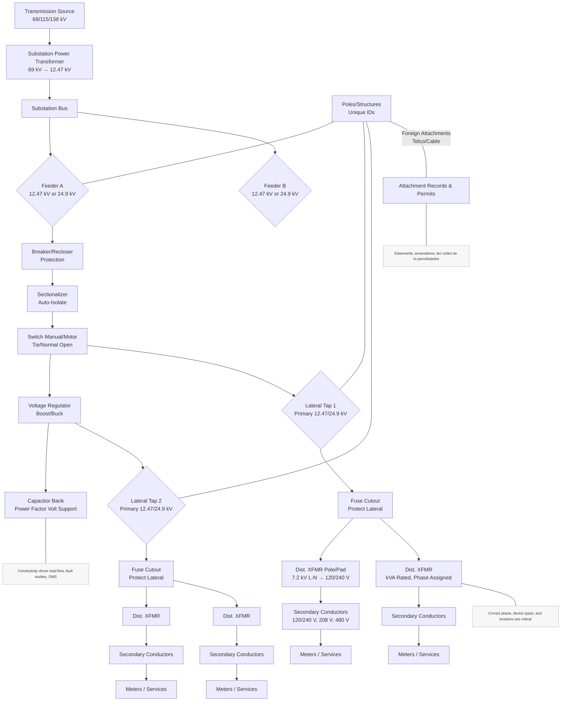
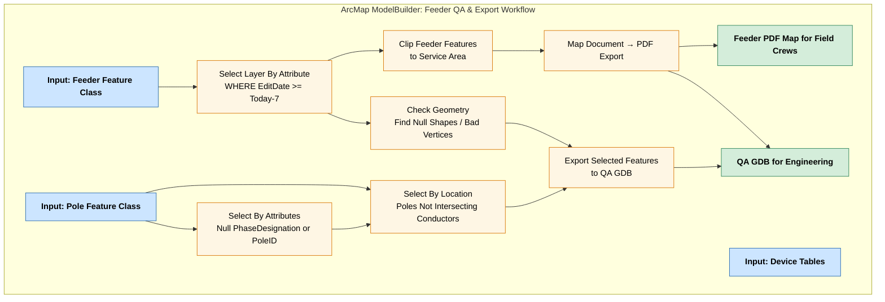
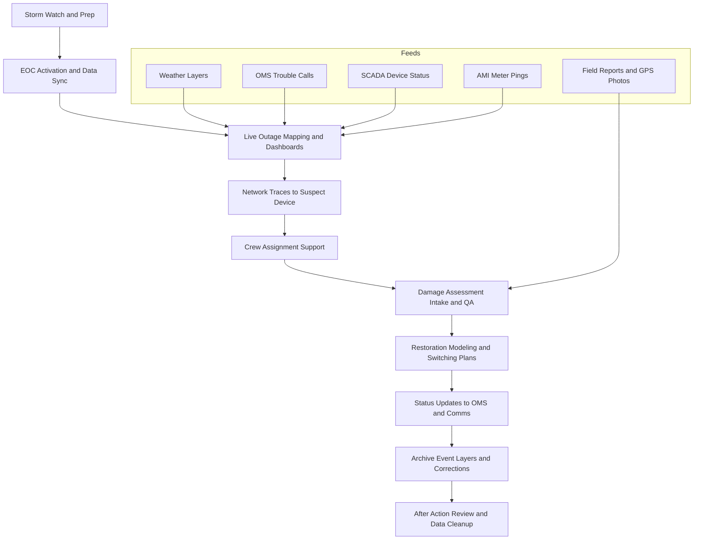

# skylynxs-react-typescript
This creates a starter image for quickly creating websites

> The project was created using the following command
```
npx create-react-app my-app --template typescript
```
> I have updated the base files to follow the patteren for all wbesites copy the entire folder to get starrted. 
> 
### **Env Config**
  - React Type Script(ejected)
    - my-app
      - webapp
    - data

## How to Use
copy the client floder should be copied when using this image bind the client folder to a local volume with readwrite

- use the dev compose while building website once built use Prod
- to create a production image
- once the production image is ready we can use awsci to copy file to s3 bucket or spin up vm with docker file
might need to run 

npm install --save-dev @types/node 
 in dev mode  
When you are ready to start

```
docker-compose -f docker-compose-dev.yml up -it
```
> To test code you need to run these command inside of the docker container
> 
```
docker-compose -f docker-compose-dev.yml up -d or

```

> to stop
>
```
docker-compose -f docker-compose-dev.yml down
```

## Test Depoly
> Here I just listed the script commands to run to process th script
> You need to manually create the silverlining network externally once:k 
>

``` bash
docker network create --driver bridge silverlining

```

## Production build
> This section will cpverthe details of how the scripts were written then the commands to run to process the script

> We will pus
## aws s3 command-

```
 aws s3 - help
```
**LocalPath**: represents the path of a local file or directory.  It can
be written as an absolute path or relative path.

**S3Uri:** represents the location of a S3 object, prefix, or bucket.
This must be written in the form "s3://mybucket/mykey" where
"mybucket" is the specified S3 bucket, "mykey" is the specified S3
key.  The path argument must begin with "s3://" in order to denote
that the path argument refers to a S3 object. Note that prefixes are
separated by forward slashes. For example, if the S3 object "myobject"
had the prefix "myprefix", the S3 key would be "myprefix/myobject",
and if the object was in the bucket "mybucket", the "S3Uri" would be
"s3://mybucket/myprefix/myobject.

Single Local File and S3 Object Operations
==========================================

>Some commands perform operations only on single files and S3 objects.
The following commands are single file/object operations if no "--
recursive" flag is provided.

    **"cp"**

   ** "mv"**

    **"rm"**
>


## Push Build

# GitHub Setup
this sections covers how to config git hub and make it work with AWS for easy publishing of the websites and servers also make sure you are using a git bash window for these commands to work. Make sure you are using the correct branch. Create a new dev branch until the first release then push new branch to trunk once we publish to server trunk branch is production branch. all dev branches are called main 

## First thing test to see you are logged in to github
``` bash
git config --global user.name
```

## Setup repo 

- Initialize Git (if not already done):
``` bash
 git init

```
- Add the remote GitHub repo:

``` bash
git add .
git commit -m "Initial commit"
git remote add origin https://github.com/<your-username>/<your-repo>.git
git push -u origin main
```

example for this repo

``` bash
git add .
git commit -m "Initial commit Main branch"
git remote add origin https://github.com/kurickabides/skylynx-server.git
git push -u origin main
```

#GIS Model

## ArcMap ModelBuilder utility examples

# storm workflow



### gANT sTORM

```mermaid
gantt
  title Storm Day Timeline for GIS
  dateFormat HH:mm
  axisFormat %H:%M

  section Early Activation
  EOC standup and sync with OMS and SCADA        :done,    06:00, 01:00
  Load offline maps for crews                     :active,  06:30, 00:45

  section Impact Window
  Live outage intake and aggregation              :         07:30, 04:00
  Downstream and upstream traces to suspect device:         08:00, 03:30
  Crew assignment maps and grid access notes      :         08:30, 03:00

  section Damage Assessment
  Field reports ingest and QA location accuracy   :         12:00, 04:00
  Update dashboards and restoration estimates     :         12:30, 03:30
  Candidate switching plans and tie options       :         13:00, 03:00

  section Restoration Tracking
  Device status updates and map refresh           :         16:00, 03:00
  Customer counts by outage polygon               :         16:15, 02:45
  Comms exports web and print map sets            :         17:00, 02:00

  section Wrap Up
  Archive event layers and notes                  :         19:00, 01:00
  Correct GIS features flagged during response    :         19:30, 01:00
  After action packet for engineering and ops     :         20:00, 01:00


```
